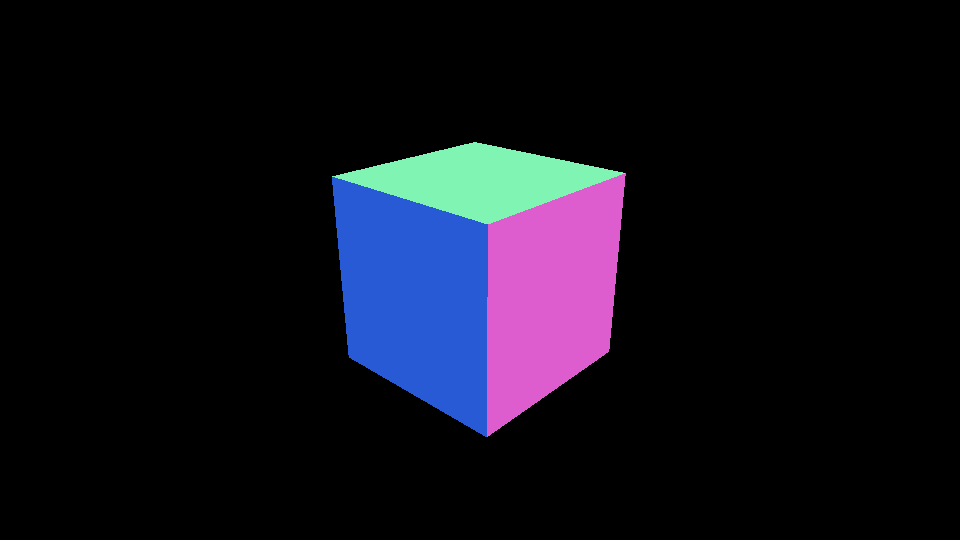
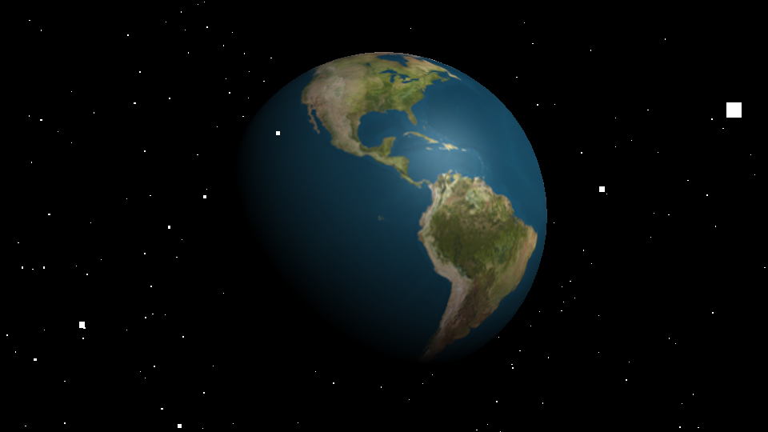

Three.jsには**カメラの動きを自動的に制御する `THREE.OrbitControls` クラスが存在**します。


立体を中心にして周回軌道を描くように、カメラを配置するのが便利です。

## 導入方法

`OrbitControls.js`は、Three.jsライブラリの本体に含まれていないので注意が必要です。公式GitHubの`examples/js/controls`フォルダーにJavaScriptファイルがあるので、これを`script`要素で読み込みます。作業用フォルダーに`OrbitControls.js`ファイルをコピーしておきましょう。

```html
<script src="js/controls/OrbitControls.js"></script>
```


## 使い方

`THREE.OrbitControls`は次のような書式で利用します。`THREE.OrbitControls`クラスのコンストラクターにカメラのインスタンスを指定します。これだけで、自動的にマウスと連動してインタラクションが効くようになります。

```js
// カメラを作成
const camera = new THREE.PerspectiveCamera(/*省略*/);
// カメラの初期座標を設定
camera.position.set(0, 0, 1000);

// カメラコントローラーを作成
const controls = new THREE.OrbitControls(camera);
```

マウス操作で次のようにカメラを制御できます。

- オービット（周回軌道）: 左ボタンでドラッグ
- ズーム: マウスホイール
- パン: 右ボタンでドラッグ


実行可能な最小のサンプルコードはこちらです。

```js
// サイズを指定
const width = 960;
const height = 540;

// レンダラーを作成
const renderer = new THREE.WebGLRenderer({
  canvas: document.querySelector('#myCanvas'),
});
renderer.setSize(width, height);

// シーンを作成
const scene = new THREE.Scene();

// カメラを作成
const camera = new THREE.PerspectiveCamera(45, width / height, 1, 10000);
camera.position.set(0, 0, 1000);

// カメラコントローラーを作成
const controls = new THREE.OrbitControls(camera);

// 形状とマテリアルからメッシュを作成します
const mesh = new THREE.Mesh(
  new THREE.BoxGeometry(300, 300, 300),
  new THREE.MeshNormalMaterial());
scene.add(mesh);

tick();

// 毎フレーム時に実行されるループイベントです
function tick() {
  // レンダリング
  renderer.render(scene, camera);
  requestAnimationFrame(tick);
}
```




- [サンプルを再生する](https://ics-creative.github.io/tutorial-three/samples/camera_orbitcontrols_basic.html)
- [サンプルのソースコードを確認する](../samples/camera_orbitcontrols_basic.html)


### 滑らかにコントロールする

`enableDamping`や`dampingFactor`プロパティーを設定すると、ドラッグ時にカメラが滑らかに動くようになります。デフォルトだと機械的な動きになってしまいますが、これらのプロパティーを設定するだけで心地いい使い勝手となります。

`enableDamping`や`dampingFactor`プロパティーを使う場合は、`requestAnimationFrame`内で`THREE.OrbitControls`インスンタンスの`update`メソッドを呼び出す必要があります。

```js

// カメラを作成
const camera = new THREE.PerspectiveCamera(/*省略*/);
// カメラの初期座標を設定
camera.position.set(0, 0, 1000);

// カメラコントローラーを作成
const controls = new THREE.OrbitControls(camera);

// 滑らかにカメラコントローラーを制御する
controls.enableDamping = true;
controls.dampingFactor = 0.2;

tick();

// 毎フレーム時に実行されるループイベントです
function tick() {
  // カメラコントローラーを更新
  controls.update();

  // レンダリング
  renderer.render(scene, camera);

  requestAnimationFrame(tick);
}
```




- [サンプルを再生する](https://ics-creative.github.io/tutorial-three/samples/camera_orbitcontrols.html)
- [サンプルのソースコードを確認する](../samples/camera_orbitcontrols.html)


## まとめ

カメラを手軽に制御できるので、小さな作例ではOrbitControlsを使われることが多いです。ただし、手軽である分、カスタマイズの自由度の制限があるので、細かいカメラワークを作ろうとしたらOrbitControlsでは物足りません。カメラの制御はいろんなコードを書いて自作して覚えていくといいでしょう。


次回の記事では、モデリングデータの読み込み方法を説明します。

[次の記事へ](model_basic.md)

