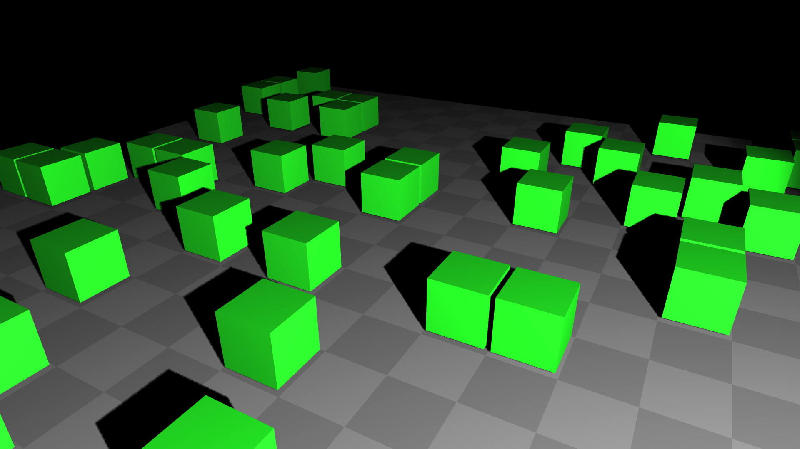
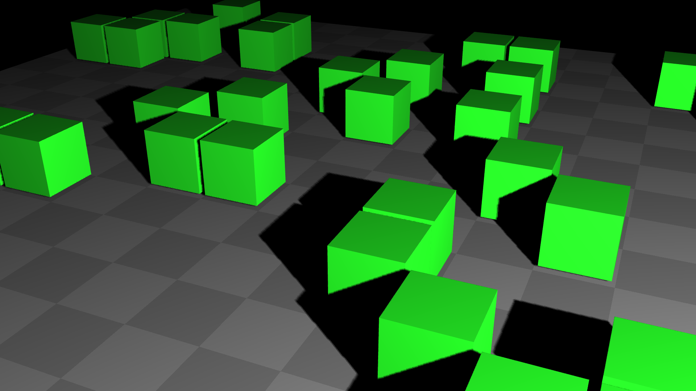
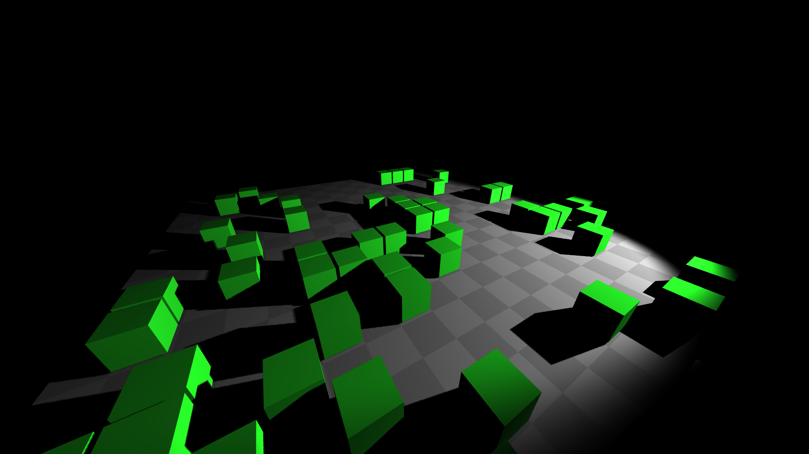
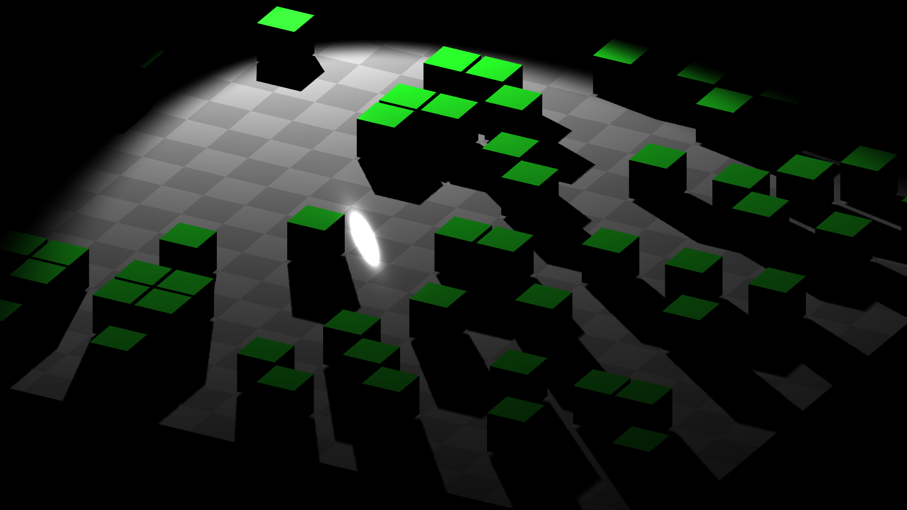
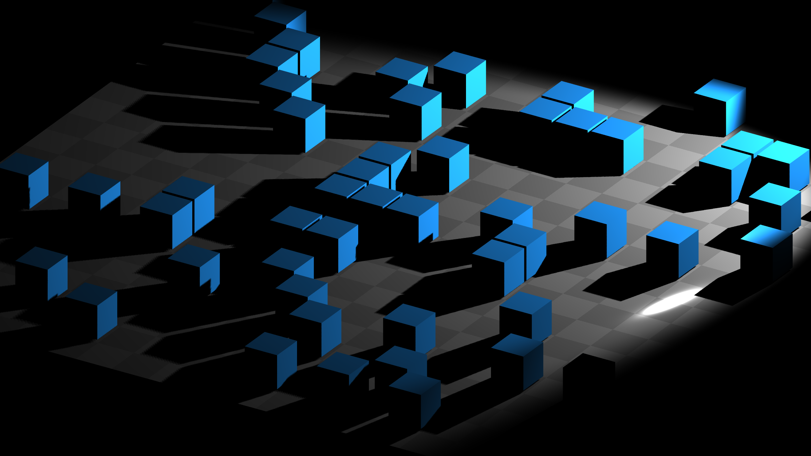

Three.jsにはCamera3Dクラスがあることを、入門編で紹介しました。このCamera3Dがどのようにして利用できるのか、もう少し掘り下げて学んでみましょう。

Three.jsにさまざまな種類のカメラが搭載されています。 

カメラの種類

- `THREE.PerspectiveCamera` : 遠近感が適用されるカメラ
- `THREE.OrthographicCamera`  : 平行投影が適用されるカメラ

本節では`PerspectiveCamera`と`OrthographicCamera`の2種類を掘り下げて解説します。

## PerspectiveCamera 



- [サンプルを再生する](https://ics-creative.github.io/tutorial-three/samples/camera_perspective.html)
- [サンプルのソースコードを確認する](../samples/camera_perspective.html)

遠近感を表現できるカメラです。`PerspectiveCamera`インスタンスの`fov`プロパティーを設定することで、カメラの視野角を変更できます。視野角とはカメラが映し出せる範囲のことです。 

```js
// new THREE.PerspectiveCamera(視野角, アスペクト比, near, far)
const camera = new THREE.PerspectiveCamera(45, width / height, 1, 2000);
```

`fov`プロパティーは次の書式で変更できます。単位は角度です。ちなみに、`fov`はField of View＝視野角の頭文字の略語です。

```js
camera.fov = 60; 
```


▲`fov`が30度だと、レンズが望遠となります。遠近感をそれほど強調したくない場合は視野角を小さくするとよいでしょう。 



▲`fov`が90度だと、レンズが広角となりカメラに近い3Dオブジェクトも視野角に入ります。遠近感を強調したい場合は視野角を大きくするとよいでしょう。 

## OrthographicCamera 



- [サンプルを再生する](https://ics-creative.github.io/tutorial-three/samples/camera_orthographic.html)
- [サンプルのソースコードを確認する](../samples/camera_orthographic.html)

`OrthographicCamera`は平行投影を表現できるカメラです。このカメラには遠近感がないので、手前にある3Dオブジェクトも奥にある3Dオブジェクトも同じ大きさで表示されます。 

```js
// new THREE.OrthographicCamera(left, right, top, bottom, near, far)
const camera = new THREE.OrthographicCamera(-480, +480, 270, -270, 1, 1000);
```

サンプルのように規則正しく3Dオブジェクトを配置すると、平行投影のゲームのような表現が得られます。 



## 共通の設定：クリッピング 

3D空間に存在するすべてのポリゴンをレンダリングするとパフォーマンスをムダに使ってしまうので、クリッピングという機能がレンズには備わっています。カメラから見て一定距離区間の間に存在するオブジェクトだけをレンダリングし、その距離の区間の外のオブジェクトはレンダリングしないというしくみです。クリッピングは次の2つのプロパティーで制御されます。

プロパティー 

- `near` : 区間の開始距離 
- `far` : 区間の終了距離 

Three.jsでは`near`のデフォルト値は1、`far`のデフォルト値は2000に設定されています。とくに`far`の値はかなり小さく設定されていますので、必要に応じて大きな値に変更するとよいでしょう。 
