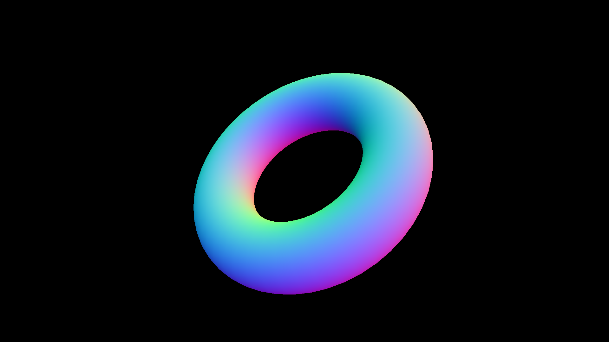
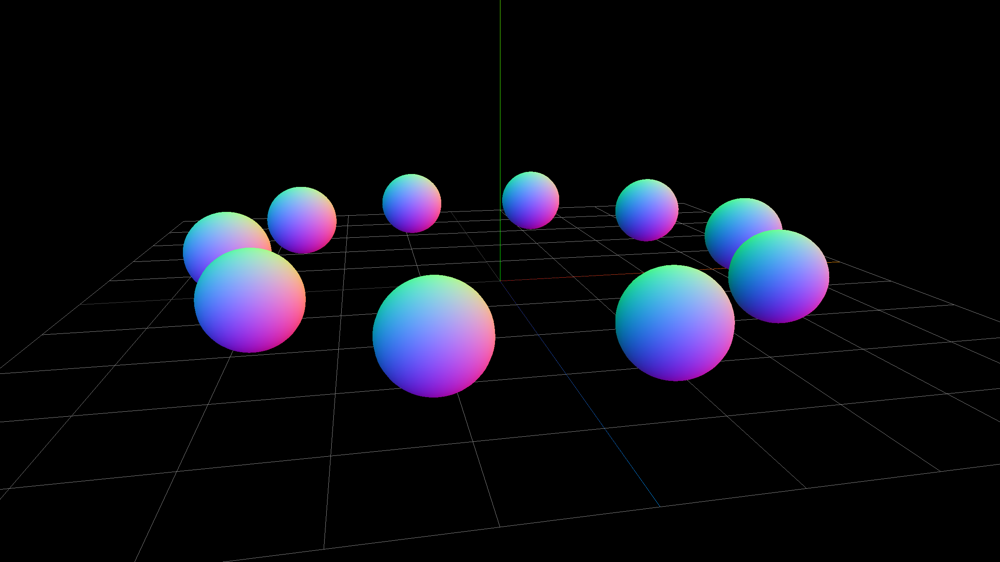

JavaScriptではオブジェクト指向としてのクラスが利用できます。クラスを利用すると、Three.jsを構造的に設計しやすくなります。

たとえば、カーゲームを想像してみましょう。カーゲームにはさまざまな表示物が登場します。自機、敵機、コース、背景など。これらを1つのJavaScriptファイルで管理するのは難しいと言わざるを得ません。1つのソースコードに異なる表示物のプロパティーや変数が乱立し、管理が大変になるでしょう。

クラスだと、自機を1つのクラス、敵機を1つのクラス・・・と分離できます。そうすれば、自機を開発しているときは、他のオブジェクトのことを気にせず安心して開発に取り掛かれます。結果として、長いコードを書いたときの生産性・可読性・保守性が向上するでしょう。

クラスは、ECMAScript 2015（略称：ES2015、ES6）仕様の`class`キーワードを利用します。クラスの仕様の説明は割愛しますので、知らない人は別途参考資料を読んでください。


## メッシュのサブクラスを作る

クラスの手軽な使いみちとして、メッシュのサブクラスを作ってみましょう。次のサンプルではドーナツ形状の表示オブジェクトを表示したものです。



- [サンプルを再生する](https://ics-creative.github.io/tutorial-three/samples/class_mesh.html)
- [サンプルのソースコードを確認する](../samples/class_mesh.html)


このサンプルでは、ドーナツ`Donuts`クラスのメッシュを`THREE.Mesh`クラスのサブクラスとして作成しています。`THREE.Mesh`クラスを継承するには、クラス宣言に`extends THREE.Mesh`と記述します。そうすれば、`Donuts`クラスは`THREE.Mesh`を継承したクラスとして定義されます。

```js
/** メッシュを継承したドーナツクラスです。 */
class Donuts extends THREE.Mesh {
}
```

コンストラクター`constructor()`では、ジオメトリとマテリアルを作成し、`super()`メソッドに代入しています。


```js
/** メッシュを継承したドーナツクラスです。 */
class Donuts extends THREE.Mesh {

  /** コンストラクターです。 */
  constructor() {
    // ジオメトリを作成
    const geometry = new THREE.TorusGeometry(120, 40, 60, 50);

    // マテリアルを作成
    const material = new THREE.MeshNormalMaterial();

    // 継承元のコンストラクターを実行
    super(geometry, material);
  }
}
```

こうすれば、ドーナツを利用するときにわざわざジオメトリとマテリアルを作成してなくても、`new Donuts()`と記述するだけでドーナツを表示できるようになります。


```js
// ドーナツを作る
const mesh = new Donuts();
scene.add(mesh);
```

サンプルのソースコードを見ると、`init()`関数の中身がシンプルになり、読みやすくなりましたね。

```js
function init() {
  // 省略：レンダラーやカメラ、シーンを作成（詳しくはサンプルのソースコードを）

  // ドーナツを作る
  const mesh = new Donuts();
  scene.add(mesh);

  tick();

  // 毎フレーム時に実行されるループイベントです
  function tick() {
    mesh.rotation.x += 0.02;
    mesh.rotation.y += 0.01;

    // レンダリング
    renderer.render(scene, camera);
    requestAnimationFrame(tick);
  }
}
```

## グループのサブクラスを作る

クラスのよくある利用方法として、Three.jsのグループにもクラスを使ってみましょう。次のサンプルは複数の球体を一つのグループにまとめたものです。



- [サンプルを再生する](https://ics-creative.github.io/tutorial-three/samples/class_group.html)
- [サンプルのソースコードを確認する](../samples/class_group.html)


グループのサブクラスを作るには、クラス宣言に`extends THREE.Group`と記述します。すると、このクラスは`THREE.Group`クラスを継承したものとして定義されます。

```js
/** グループを継承したサブクラスです。 */
class MyGroup extends THREE.Group {
}
```

グループ化したい内容をコンストラクターへ記述します。このサンプルだと、10個の球体を作成してグループに追加しています。なお追加するときは、`THREE.Group`クラスを継承しているので、`this.add()`メソッドを実行します。`add()`メソッドで追加する場所は`this`であることに注目ください。

```js
/** グループを継承したサブクラスです。 */
class MyGroup extends THREE.Group {

  constructor() {
    // 何かのクラスを継承した場合はsuper()を呼び出す必要がある
    super();

    const length = 10; // for文の回数
    for (let i = 0; i < length; i++) {
      // 直方体を作成
      const material = new THREE.MeshNormalMaterial();
      const geometry = new THREE.SphereGeometry(30, 30, 30);
      const mesh = new THREE.Mesh(geometry, material);

      // 配置座標を計算
      const radian = i / length * Math.PI * 2;
      mesh.position.set(
        200 * Math.cos(radian), // X座標
        30, // Y座標
        200 * Math.sin(radian) // Z座標
      );

      // グループに追加する
      this.add(mesh);
    }
  }
}
```

利用したい場所では`new MyGroup()`と呼び出すだけです。

```js
// グループを作る
const group = new MyGroup();
// 3D空間にグループを追加する
scene.add(group);
```

これも`init()`関数の中身がシンプルになり、読みやすくなりましたね。

```js
function init() {
  // 省略：レンダラーやカメラ、シーンを作成（詳しくはサンプルのソースコードを）

  // グループを作る
  const group = new MyGroup();
  // 3D空間にグループを追加する
  scene.add(group);

  tick();

  // 毎フレーム時に実行されるループイベントです
  function tick() {
    group.rotation.y += 0.01;

    // レンダリング
    renderer.render(scene, camera);
    requestAnimationFrame(tick);
  }
}
```

この解説は[Three.jsでES2015のclassを利用する（メソッド）](class_method.md)に続きます。

