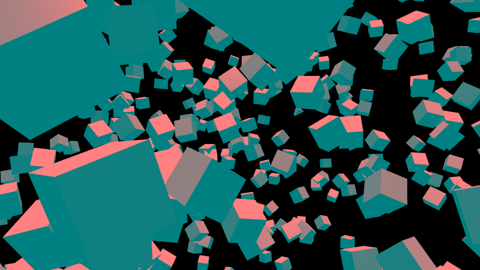

フォグ効果とは遠くのものが霞んで見えるような状態にする効果のことです。フォグ（Fog）は日本語で「霧、濃霧」という意味です。

Three.jsではカメラからの開始距離と終点距離を設定することで、その間に存在するオブジェクトが指定した色によって霞んで表示されます。


## フォグのサンプル 


- [サンプルを再生する](https://ics-creative.github.io/tutorial-three/samples/fog.html)
- [サンプルのソースコードを確認する](../samples/fog.html)

このサンプルでは1000個の立方体をランダムに配置。カメラから遠いオブジェクトほど暗く表示されています。これは照明効果ではなく、フォグの機能で暗くなっています。


フォグを設定していない場合の見え方と比較すると、この効果がわかりやすいでしょう。カメラから遠い場所に注目ください。



▲フォグを設定していない場合の見え方


## フォグの設定方法

フォグを設定するには`THREE.Scene`オブジェクトの`fog`プロパティーに、`THREE.Fog`インスタンスを代入します。

```js
// シーンを作成
const scene = new THREE.Scene();

// フォグを設定
// new THREE.Fog(色, 開始距離, 終点距離);
scene.fog = new THREE.Fog(0x000000, 50, 2000);
```

わずか一行のコードを加えるだけで空間の奥行きを表現できるので、手軽に試すことのできる機能です。
