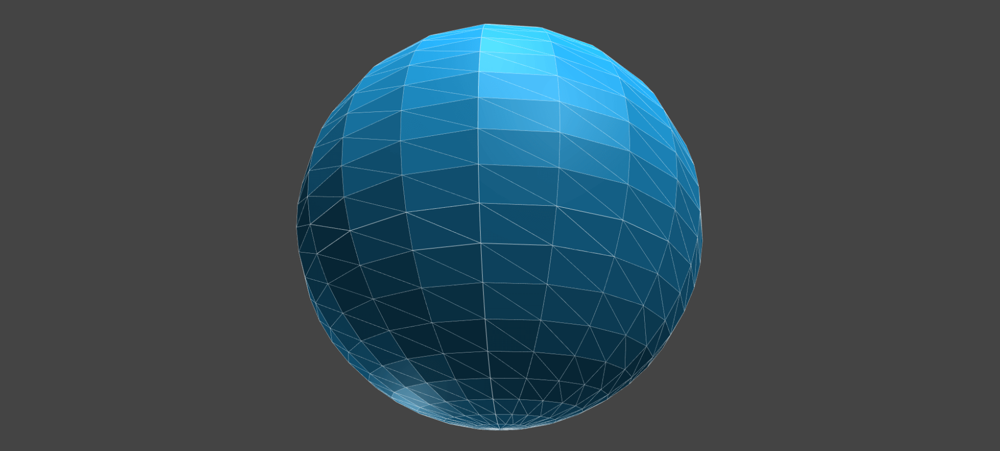
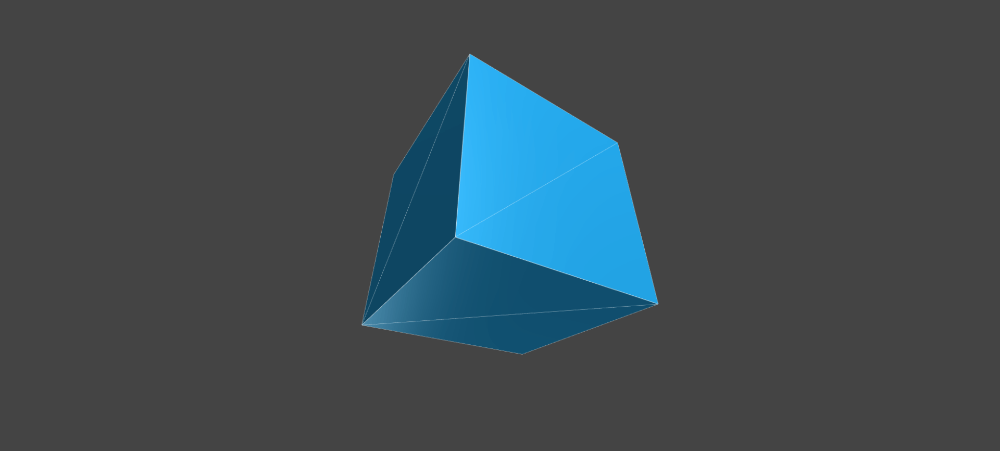
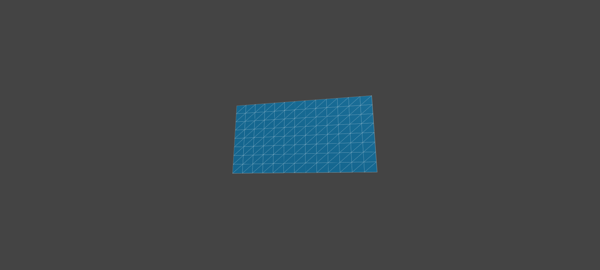
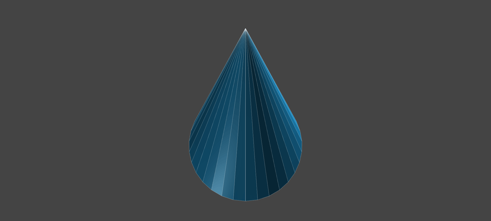
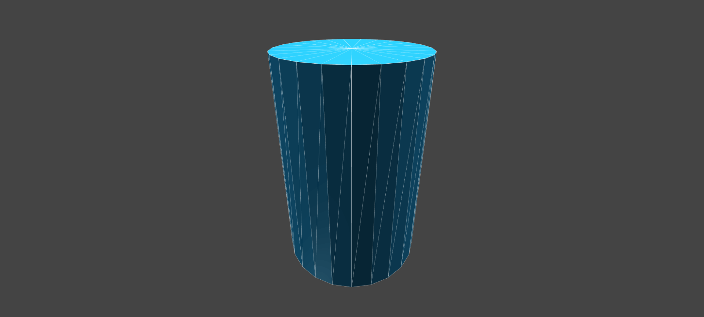
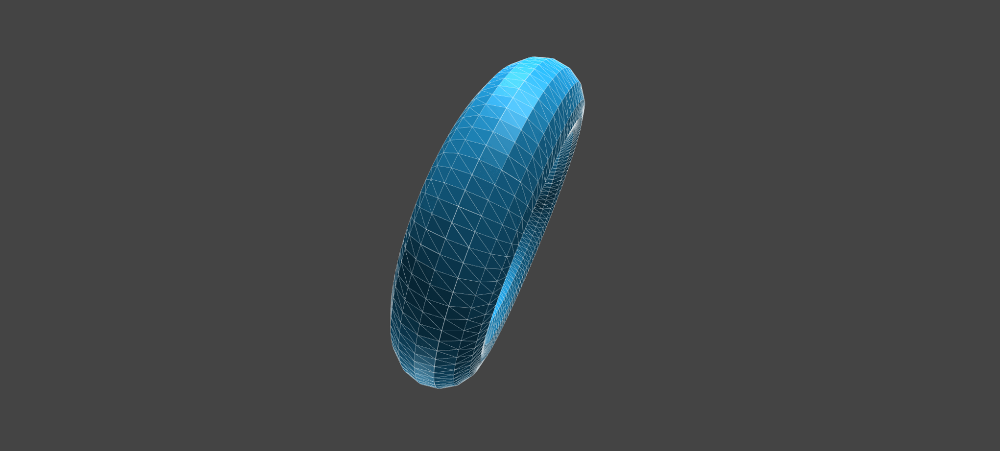

形状（ジオメトリとも言います）を指定することで「球体」や「直方体」、「平面」などさまざまな3Dのオブジェクトを表示できます。言葉で説明するより、実際に動くものを見たほうがわかりやすいと思いますので、次のデモを試してみてください。


- [サンプルを再生する](https://ics-creative.github.io/tutorial-three/samples/geometry_general.html)
- [サンプルのソースコードを確認する](../samples/geometry_general.html)


上記のデモのような形状がThree.jsで扱える基本的な形状として、いくつか用意されています。代表的なものを紹介します。

* 平面
* 球体
* 直方体
* 三角錐
* 円柱
* カプセル形状
* ドーナツ形状

## 基本的な形状を利用するためのサンプルコード

Three.jsでは形状とマテリアルを結合しメッシュを作成することによって、表示可能な3Dのオブジェクトを得ることができます。形状はクラスのインスタンスを作成することで用意できます。

具体的なコードですが、球体の場合を例にして紹介しますと次の①の部分を変更すれば任意の形状を設定できます。

```js
// ①ジオメトリを作成
const geometry = new THREE.SphereGeometry(300, 30, 30);
// マテリアルを作成
const material = new THREE.MeshPhongMaterial({color: 0xFF0000});
// メッシュを作成
const mesh = new THREE.Mesh(geometry, material);
// 3D空間にメッシュを追加
scene.add(mesh);
```

## さまざまな形状のスクリプトを確認する

Three.jsに用意されているさまざまな形状を実現するコードを見て行きましょう。なお、それぞれの形状のクラスファイルは`Geometry`という名前がついています。

### 球体のジオメトリ



```js
const geometry = new THREE.SphereGeometry( 5, 32, 32 );
const material = new THREE.MeshBasicMaterial( {color: 0xFF0000} );
const sphere = new THREE.Mesh( geometry, material );
scene.add( sphere );
```

※このジオメトリの使い方は公式ドキュメント（英語）の「[SphereGeometry \- three\.js docs](https://threejs.org/docs/#api/geometries/SphereGeometry)」を確認ください。


### 直方体のジオメトリ



```js
const geometry = new THREE.BoxGeometry( 1, 1, 1 );
const material = new THREE.MeshBasicMaterial( {color: 0xFF0000} );
const cube = new THREE.Mesh( geometry, material );
scene.add( cube );
```


※このジオメトリの使い方は公式ドキュメント（英語）の「[BoxGeometry \- three\.js docs](https://threejs.org/docs/#api/geometries/BoxGeometry)」を確認ください。


### 平面のジオメトリ



```js
const geometry = new THREE.PlaneGeometry( 5, 20, 32 );
const material = new THREE.MeshBasicMaterial( {color: 0xFF0000, side: THREE.DoubleSide} );
const plane = new THREE.Mesh( geometry, material );
scene.add( plane );
```

※このジオメトリの使い方は公式ドキュメント（英語）の「[PlaneGeometry \- three\.js docs](https://threejs.org/docs/#api/geometries/PlaneGeometry)」を確認ください。


### 三角錐のジオメトリ



```js
const geometry = new THREE.ConeGeometry( 5, 20, 32 );
const material = new THREE.MeshBasicMaterial( {color: 0xFF0000} );
const cone = new THREE.Mesh( geometry, material );
scene.add( cone );
```

※このジオメトリの使い方は公式ドキュメント（英語）の「[ConeGeometry \- three\.js docs](https://threejs.org/docs/#api/geometries/ConeGeometry)」を確認ください。


### 円柱のジオメトリ



```js
const geometry = new THREE.CylinderGeometry( 5, 5, 20, 32 );
const material = new THREE.MeshBasicMaterial( {color: 0xFF0000} );
const cylinder = new THREE.Mesh( geometry, material );
scene.add( cylinder );
```

※このジオメトリの使い方は公式ドキュメント（英語）の「[CylinderGeometry \- three\.js docs](https://threejs.org/docs/#api/geometries/CylinderGeometry)」を確認ください。


### ドーナツ形状のジオメトリ



```js
const geometry = new THREE.TorusGeometry( 10, 3, 16, 100 );
const material = new THREE.MeshBasicMaterial( { color: 0xFF0000 } );
const torus = new THREE.Mesh( geometry, material );
scene.add( torus );
```

※このジオメトリの使い方は公式ドキュメント（英語）の「[TorusGeometry \- three\.js docs](https://threejs.org/docs/#api/geometries/TorusGeometry)」を確認ください。


## パラメーターについて

上記で紹介した形状ですが、それぞれにクラスのコンストラクターの引数で大きさ等を指定できます。ほとんどのクラスで同じ引数を取るのですが、代表的なものを紹介すると次の通りです。

* `width` : 横幅
* `height` : 高さ
* `depth` : Cubeにおける奥行き
* `radius` : 半径。Sphereでは球体の半径で、ConeとCylinderでは底辺の半径。
* `segmentsW` : 横方向の分割数
* `segmentsH` : 縦方向の分割数

`segments`（セグメント）というパラメーターは2次元表現にないので、見慣れないパラメーターだと思います。3Dでは表示オブジェクトをポリゴン化して表示させるのですが、**セグメントというパラメーターは大雑把にいうとポリゴンの細分化の分割数となります**。たとえばセグメントを増やすと、球体（`SphereGeometry`）ではより滑らかになります。


## まとめ

今回のチュートリアルでは、基本的な形状についての解説を行いました。**平面や直方体など基本的な形状を組み合わせるだけでもさまざまな3D表現を作ることができます**。ぜひサンプルを元に色々と試してみてください。

[次の記事へ](camera_position.md)
