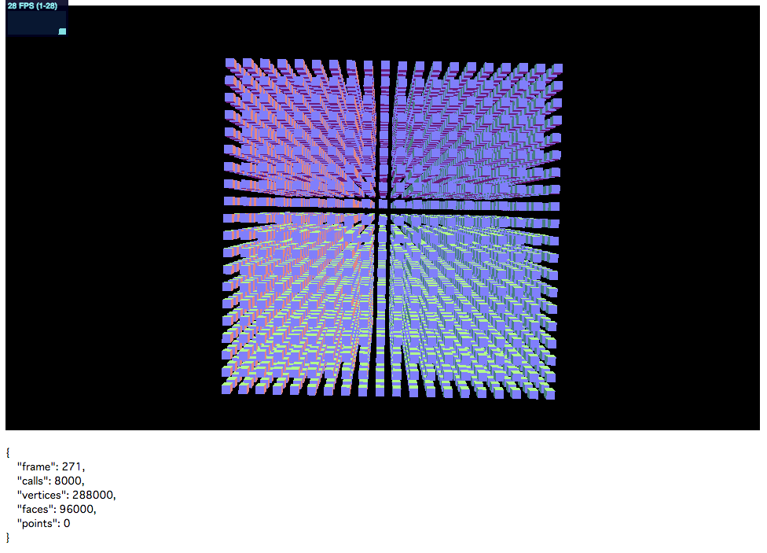
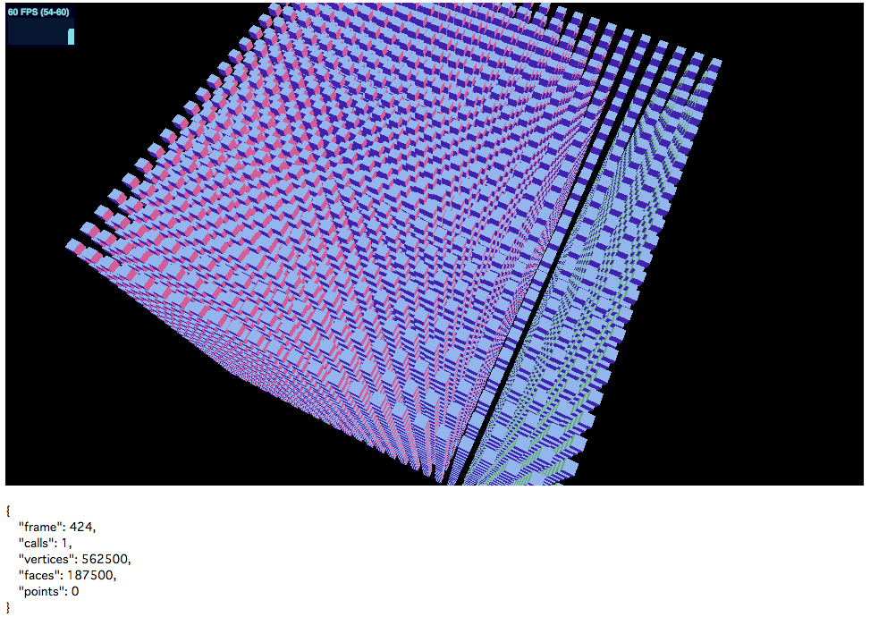

Three.jsで大量のオブジェクトを描画するときに役立つ最適化テクニックを紹介します。

## 前提

GPUを用いるコンテンツにおいてドローコール（描画の命令）の回数はパフォーマンスに大きく影響します。ドローコールの回数が少なくすれば、描画の負荷が下がります。これはThree.jsに限らずWebGL・OpenGLの一般的な知識として覚えておいてください。

## サンプルで比較

次の2つのデモの再生を比較してみてください。画面左上にはフレームレートを、画面下側にはドローコールが表示されています（ドローコール：`calls`が該当する数値）。


### 最適化前

最適化前のデモとなります。



- [サンプルを再生する](https://ics-creative.github.io/tutorial-three/samples/geometry_merge_none.html)
- [サンプルのソースコードを確認する](../samples/geometry_merge_none.html)

こちらはカクカクと滑らかに再生できないと思います。ドローコールが8000発生し、フレームレートが約30fps弱となってます。

### 最適化後

次は最適化後のデモとなります。



- [サンプルを再生する](https://ics-creative.github.io/tutorial-three/samples/geometry_merge_mesh.html)
- [サンプルのソースコードを確認する](../samples/geometry_merge_mesh.html)


どうでしょう？ 圧倒的に後者のほうが滑らかに再生できていると思います。
後者のほうは配置している3Dのオブジェクト数が2倍近く多いにもかかわらずです。ドローコールがたった1であり、フレームレートが60fpsとなってます。

最適化によってドローコールの数が激減しています。この手法について解説します。

## Three.jsでのジオメトリの結合

大量の3Dオブジェクトを表示する場合は、3Dオブジェクトのジオメトリ（3D形状における頂点の座標群）を結合することによってGPUに対するドローコールを少なくできます。3Dオブジェクトを一個一個3D空間に追加して表示するよりは、大量の立方体をまとめた巨大な3Dオブジェクトを1個だけ3D空間に追加したほうが負荷は少なくなります。

冒頭の最適化前のデモは一個一個の立方体に対してドローコールが発生しています。`scene`オブジェクトに追加されているメッシュの個数が多いです。

▼最適化前のコード

```js
// 1辺あたりに配置するオブジェクトの個数
const CELL_NUM = 20;

// 共通マテリアル
const material = new THREE.MeshNormalMaterial();
// Box
for (let i = 0; i < CELL_NUM; i++) {
  for (let j = 0; j < CELL_NUM; j++) {
    for (let k = 0; k < CELL_NUM; k++) {
      // 立方体個別の要素を作成
      const mesh = new THREE.Mesh(
        new THREE.BoxGeometry(5, 5, 5),
        material
      );

      // XYZ座標を設定
      mesh.position.set(
        10 * (i - CELL_NUM / 2),
        10 * (j - CELL_NUM / 2),
        10 * (k - CELL_NUM / 2)
      );

      // メッシュを3D空間に追加
      scene.add(mesh);
    }
  }
}
```

Three.jsでは、`THREE.BufferGeometryUtils.mergeBufferGeometries()`メソッドで結合できます。このメソッドはThree.js本体のコードに含まれていないので注意ください。公式GitHubの`examples/js/utils`フォルダーにJavaScriptファイルがあるので、これを`script`要素で読み込みます。作業用フォルダーに`BufferGeometryUtils.js`ファイルをコピーしておきましょう。該当ファイルは[こちら](https://github.com/mrdoob/three.js/blob/dev/examples/js/utils/BufferGeometryUtils.js)からダウンロードできます。

```html
<script src="js/utils/BufferGeometryUtils.js"></script>
```

コードは次のように記述します。`scene`オブジェクトに追加されているメッシュはたった1個であることに注目してください。ジオメトリの配置座標を調整するには`translate()`メソッドを利用します。

▼最適化後のコード（1）

```js
// 1辺あたりに配置するオブジェクトの個数
const CELL_NUM = 25;
// 結合用のジオメトリを格納する配列
const boxes = [];
for (let i = 0; i < CELL_NUM; i++) {
  for (let j = 0; j < CELL_NUM; j++) {
    for (let k = 0; k < CELL_NUM; k++) {
      // 立方体個別の要素を作成
      const geometryBox = new THREE.BoxGeometry(5, 5, 5);

      // 座標調整
      const geometryTranslated = geometryBox.translate(
        10 * (i - CELL_NUM / 2),
        10 * (j - CELL_NUM / 2),
        10 * (k - CELL_NUM / 2)
      );

      // ジオメトリを保存
      boxes.push(geometryTranslated);
    }
  }
}
// ジオメトリを生成
const geometry = THREE.BufferGeometryUtils.mergeBufferGeometries(boxes);

// マテリアルを作成
const material = new THREE.MeshNormalMaterial();
// メッシュを作成
const mesh = new THREE.Mesh(geometry, material);
scene.add(mesh);
```


## ジオメトリ結合のデメリット

ジオメトリをまとめてしまうと、3Dオブジェクト（`Mesh`のインスタンス）としては1つになります。そのため、個別にマテリアルを設定したりマウスイベントを設定することができなくなります。

インタラクションをしないもの、アニメーションしないものを対象に、このテクニックを適用するといいでしょう。


### 関連

Node.js関連のバンドルツールで`BufferGeometryUtils`を利用する場合は、以下の解説を参照ください。

- [Node.jsを使ったフロントエンド開発](nodejs.md)