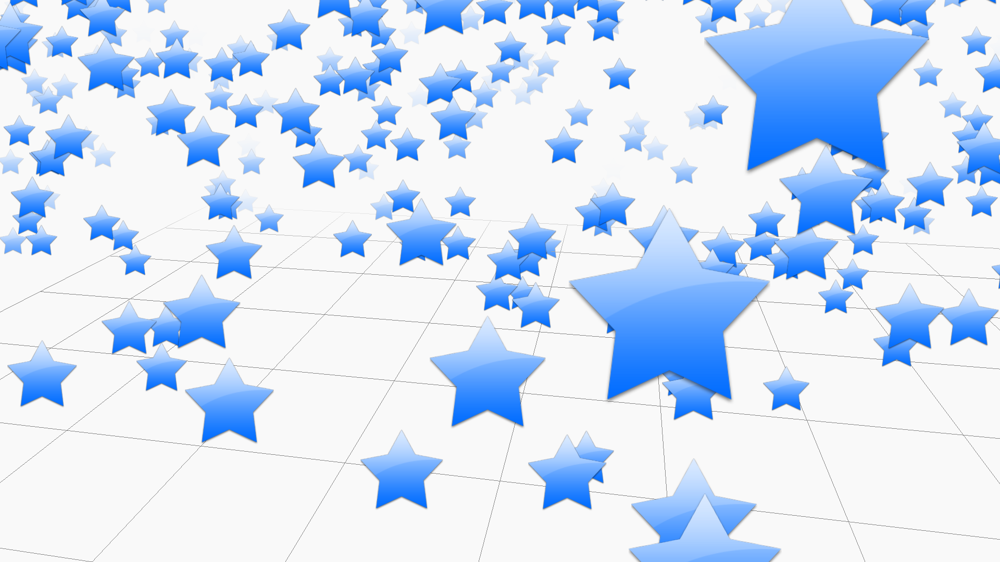
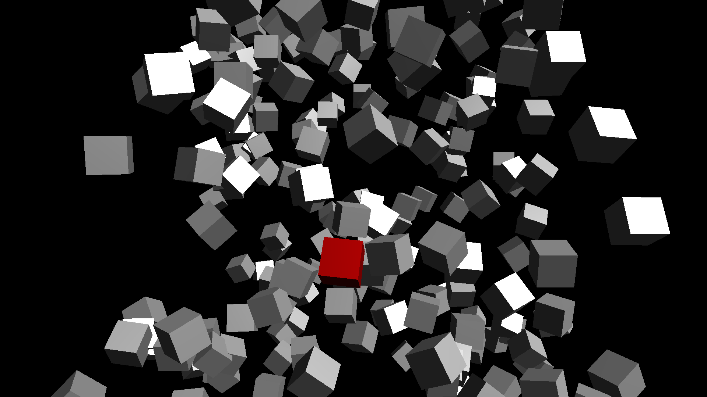
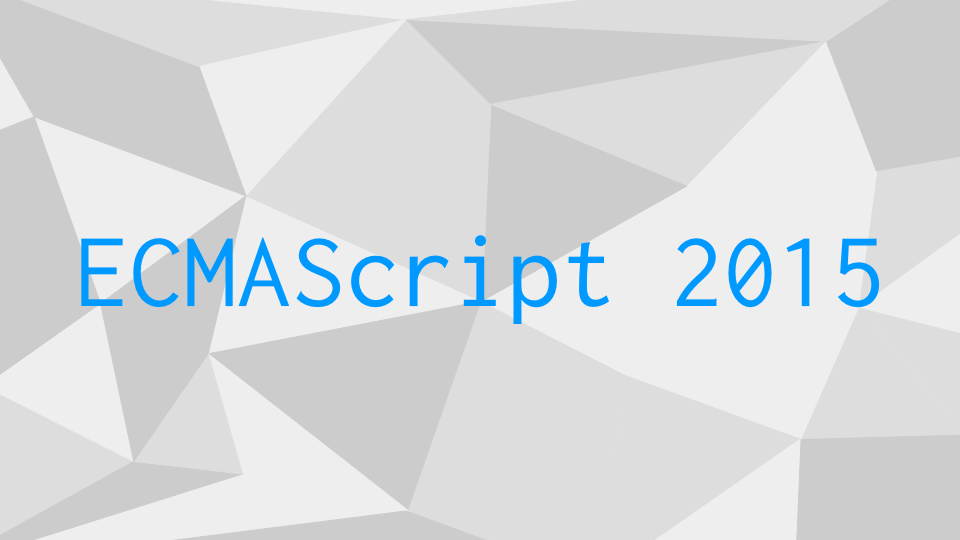

このサイトは、WebGLのライブラリ「[Three.js](https://threejs.org)」の入門サイトです。

初学者から学べるように基本から解説しつつ、発展的な内容までまとめています。このサイトを通して、ウェブの3Dのインタラクションデザインについて学んでいきましょう。

## Three.js概要

Three.jsは、HTML5で3Dコンテンツを制作するためのJavaScriptライブラリです。[Mr.doob](http://mrdoob.com)氏が中心となって開発されており、オープンソースソフトウェアとして個人・商用でも無償で利用できます。

WebGLだけで3D表現をするためには、立方体1つ表示するだけでも多くのJavaScriptやGLSLコードを書く必要があり専門知識も必要です。Three.jsを使えばJavaScriptの知識だけで簡単に3Dコンテンツが作成できるため、手軽に扱えるようになります。

もともと2000年代後半のFlashの時代から、ウェブの3D表現が人気を集めてきました。今では標準技術としてのWebGLが、ゲームやビジュアライゼーションなどの多くの場面で採用されています。

## Three.js入門編

まずは少ないコードでThree.jsの基本を学んでいきましょう。

- [入門編](quickstart.md)
- [マテリアルとライティング](material_basic.md)
- [ジオメトリ](geometry_general.md)
- [カメラの制御方法（座標制御）](camera_position.md)
- [カメラの制御方法（OrbitControls）](camera_orbitcontrols.md)

## Three.js基本編

Three.jsには多彩な機能が存在します。機能を習得すればするほど、実現できる表現が増えていくでしょう。

- [さまざまなマテリアル](material_variation.md)
- [さまざまなライト](light_variation.md)
- [影を落とす方法](light_shadowmap.md)
- [さまざまなカメラ](camera_variation.md)

- [フォグ](fog.md)
- [スプライト/ビルボード](sprite.md)
- [グループ化](object3d_group.md)
- [ワールド座標](position_world.md)
- [スクリーン座標](position_project.md)
- [モデルデータの読み込み](model_basic.md)

## Three.js中級編

専門的な方法も覚えていきましょう。

- [canvasのリサイズ処理](renderer_resize.md)
- [オブジェクトとの交差を調べる](raycast.md)
- [パーティクルを大量に表示](points.md)
- [ジオメトリの結合](geometry_merge.md)

## Three.jsとECMAScript 2015+

JavaScriptの新しい仕様のECMAScript 2015（略称ES2015、別名ES6）以上では、クラスを利用できます。オブジェクト指向なプログラムを用いて設計することで、規模の大きい開発に役立ちます。Three.jsでクラスを利用する方法を習得しましょう。

- [ES2015のclassを利用する（継承）](class.md)
- [ES2015のclassを利用する（メソッド）](class_method.md)

## Three.js数値計算

3Dでは、三角関数やベクトルの計算をする場面が多いです。実例を通して、これらを学んでいきましょう。

- [数学の記事一覧](math.md)

## Three.js演出編

Three.jsを使った表現を作例を通して学びましょう。

- [演出の記事一覧](effect.md)

## WebGLシェーダー編

Three.jsだけだと実現できる表現の種類に限界があります。シェーダーをGLSLでカスタマイズすることによって、表現の種類を大きく広げられます。

- [シェーダーの記事一覧](shader_md)

## WebGL応用編

WebGLの最適化や次世代の仕様について理解を深めましょう。

- [次世代WebGLの記事一覧](webgl_next.md)
- [オフスクリーンキャンバス](offscreencanvas.md)

## VR表現

3Dの知識はバーチャルリアリティーの実装にも役立ちます。

- [WebXRの記事一覧](webxr.md)

## Node.jsを使ったフロントエンド開発

効率のよい開発ができるよう、最新の開発環境の構築もしましょう。開発環境を整えれば最新のJavaScript言語仕様を利用でき、開発効率向上に役立つはずです。また、型定義のあるTypeScriptを使ってコード補完をフルに効かせて開発するのもオススメです。

- [Node.jsの記事一覧](nodejs.md)

