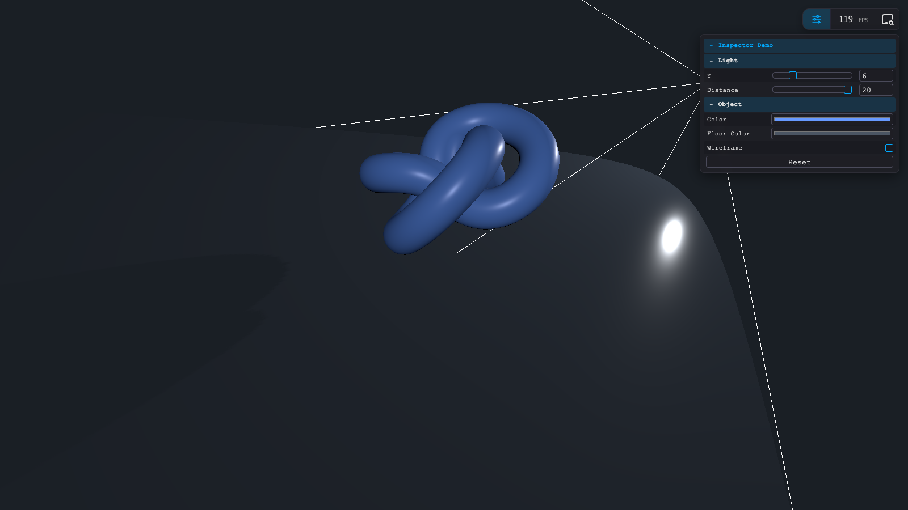
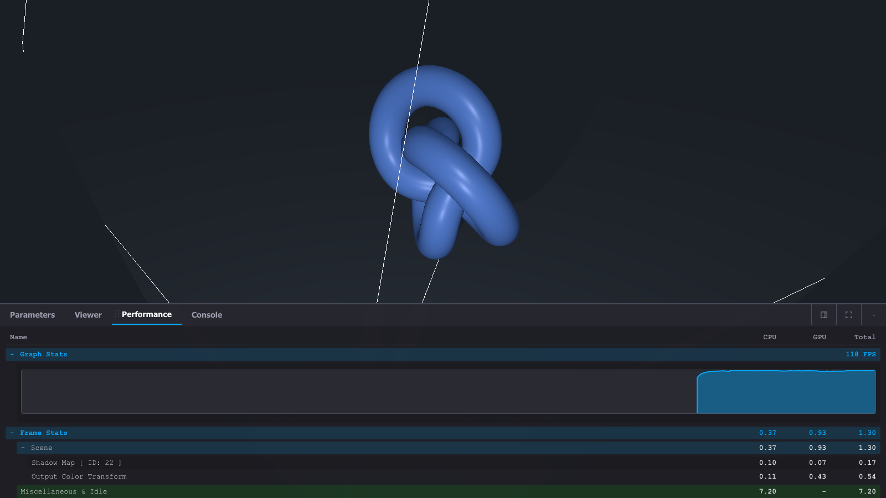
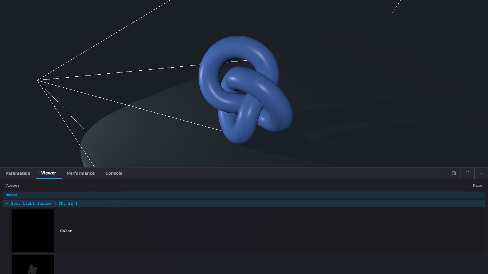

`THREE.Inspector` は、`WebGPURenderer` に組み込めるデバッグUIです。
描画パフォーマンスを確認したり、独自の調整パラメーターを追加したり、Inspector内にログを出したりできます。

このページでは、`samples/inspector.html` をもとに、Three.js の Inspector の基本的な使い方を紹介します。

## サンプル

- [サンプルを再生する](https://ics-creative.github.io/tutorial-three/samples/inspector.html)
- [サンプルのソースコードを確認する](../samples/inspector.html)

このサンプルでは、スポットライトが動くシーンに Inspector を追加しています。
`Parameters` タブからライトの位置や色を調整でき、`Performance` や `Console` もあわせて確認できます。



## Inspectorを有効にする

Inspector はレンダラーへ登録して使います。

```js
import * as THREE from "three/webgpu";
import { WebGPURenderer } from "three/webgpu";
import { Inspector } from "three/addons/inspector/Inspector.js";

// canvas を指定して WebGPURenderer を作成
const renderer = new WebGPURenderer({
  canvas: document.querySelector("#myCanvas"),
});

// Inspector をレンダラーへ登録
// この 1 行で右下に Inspector UI が追加される
renderer.inspector = new Inspector();
```

これで画面右下に Inspector が表示されます。

## importmapの設定

Inspector を使うときは、`three/addons/` に加えて `three/tsl` の importmap も必要です。

```html
<!-- Inspector は内部で three/tsl も参照する -->
<!-- サンプル本体で TSL を使わなくても、この importmap は必要 -->
<script type="importmap">
  {
    "imports": {
      "three": "https://cdn.jsdelivr.net/npm/three@0.182.0/build/three.webgpu.js",
      "three/webgpu": "https://cdn.jsdelivr.net/npm/three@0.182.0/build/three.webgpu.js",
      "three/tsl": "https://cdn.jsdelivr.net/npm/three@0.182.0/build/three.tsl.js",
      "three/addons/": "https://cdn.jsdelivr.net/npm/three@0.182.0/examples/jsm/"
    }
  }
</script>
```

サンプル本体で TSL を直接使っていなくても、`Inspector.js` の内部依存として `three/tsl` が読み込まれます。
この設定がないと、Inspector の読み込み時にランタイムエラーになります。

## Parametersタブに項目を追加する

Inspector のいちばん実用的な使い方は、`Parameters` タブへ自分の調整項目を追加する方法です。

```js
// Inspector が直接編集する設定値
// Parameters タブはこのオブジェクトの値を書き換える
const settings = {
  y: 6,
  distance: 20,
  color: 0x6699ff,
  floorColor: 0x4b5563,
  wireframe: false,
};

// Inspector で変更した値を scene へ反映
// UI と three.js オブジェクトをつなぐ役割
function apply() {
  material.color.setHex(settings.color);
  floor.material.color.setHex(settings.floorColor);
  material.wireframe = settings.wireframe;
}

// Parameters タブに専用セクションを追加
const params = renderer.inspector.createParameters("Inspector Demo");

// Light フォルダ
// 数値 + min / max / step を渡すとレンジ UI になる
const light = params.addFolder("Light");
light.add(settings, "y", 2, 20, 0.1).name("Y");
light.add(settings, "distance", 2, 20, 0.1).name("Distance");

// Object フォルダ
// addColor() はカラーピッカーになる
// boolean はチェックボックスになる
const object = params.addFolder("Object");
object.addColor(settings, "color").name("Color").onChange(apply);
object.addColor(settings, "floorColor").name("Floor Color").onChange(apply);
object.add(settings, "wireframe").name("Wireframe").onChange(apply);

// 初期値を一度見た目へ反映
apply();
```

プロパティの型によって、Inspector の UI は自動で切り替わります。

- 数値 + `min`, `max`, `step`: レンジ
- 色: カラーピッカー
- 真偽値: チェックボックス
- 関数: ボタン

このサンプルでは、Inspector が変更した値を `settings` に持たせて、`apply()` で three.js のオブジェクトへ反映しています。
この形にしておくと、リセット処理も書きやすくなります。

## Consoleタブへメッセージを出す

Inspector には専用の `Console` タブがあります。
ブラウザーの開発者ツールとは別に、サンプル側からメッセージを表示できます。

```js
// Inspector 専用の Console タブへメッセージを追加
// 開発者ツールの console とは別
renderer.inspector.console.addMessage("info", "Parameters, Performance and Console are ready.");
```

サンプルでは、`Reset` ボタンを押したときにも `Console` タブへメッセージを出しています。

```js
const defaults = {
  y: 6,
  distance: 20,
  color: 0x6699ff,
  floorColor: 0x4b5563,
  wireframe: false,
};

const settings = {
  ...defaults,

  // 関数プロパティはボタンとして表示される
  reset: () => {
    // 初期値へ戻す
    Object.assign(settings, defaults);

    // 見た目へ反映
    apply();

    // Reset の実行結果を Inspector の Console へ表示
    renderer.inspector.console.addMessage("info", "Settings reset.");
  },
};

const object = params.addFolder("Object");
object.add(settings, "reset").name("Reset");
```

## Performanceタブで確認できること

`Performance` タブでは、フレームごとの CPU / GPU の計測値や FPS を確認できます。
アニメーションやライト、影などを追加したときに、描画負荷がどの程度増えたかを見たいときに便利です。



## Viewerタブとは

`Viewer` タブは、Inspector が収集したノードの出力を小さなプレビューで表示するタブです。
主に内部の描画ノードやシャドウ関連のノードが表示されます。

今回のサンプルでも、スポットライトのシャドウに関連する `Color` や `Depth` が `Viewer` に現れることがあります。
自分で TSL を書いていなくても、レンダラー内部のノードが表示対象になる場合があります。



## 類似ライブラリとの違い

Three.js の開発では、昔から [`lil-gui`](https://github.com/georgealways/lil-gui) や [`dat.GUI`](https://github.com/dataarts/dat.gui) を使ってパラメーター調整を行うことがよくあります。
また、FPS の確認には [`stats.js`](https://github.com/mrdoob/stats.js) を使うこともあります。

- `lil-gui` / `dat.GUI`: 調整 UI を追加するためのライブラリ
- `stats.js`: FPS を確認するためのライブラリ
- `THREE.Inspector`: 調整 UI、パフォーマンス表示、Viewer、Console をまとめて扱える機能

そのため、Inspector は `lil-gui` や `stats.js` を別々に組み合わせていた用途を、Three.js 側の機能としてまとめて扱える点が特徴です。
特に `WebGPURenderer` を使ったサンプルでは、Three.js の描画情報と近い場所で確認できるのが利点です。

## まとめ

Three.js では、見た目を調整しながら同時に描画性能も確認することが重要です。
Inspector を使うと、パラメーター調整とパフォーマンス確認を同じ画面で進められます。
試行錯誤を速く回したいときや、見た目と負荷のバランスを探りたいときに役立つでしょう。
