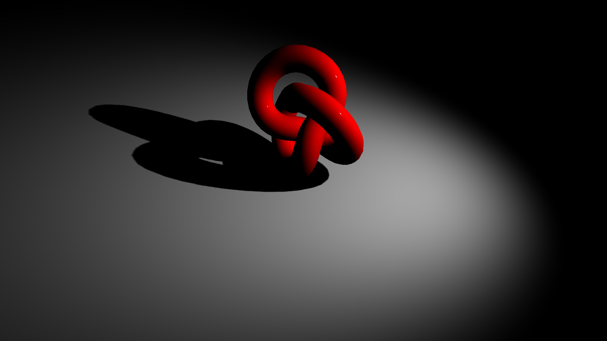

Threeでは光源に対してオブジェクトの影を別のオブジェクトに落とすことができます。影を落とすことで、リアリティーの向上につながります。

この機能を利用するには次のように4つの設定を行います。 

1. レンダラーで影を有効に設定する 
2. 光源の影を有効にする 
3. 影を落としたいMeshオブジェクトを設定する
4. 影を受けるMeshオブジェクトを設定する

ここで注意する必要があるのは「影を落とす」と「影を受ける」の2点です。
それぞれ`castShadow`プロパティー（影を落とす属性）と`receiveShadow`プロパティー（影を受ける属性）をそれぞれ設定します。


## サンプルの紹介




- [サンプルを再生する](https://ics-creative.github.io/tutorial-three/samples/light_shadowmap.html)
- [サンプルのソースコードを確認する](../samples/light_shadowmap.html)


レンダラーの`shadowMap`プロパティーで有効にします。

```js
// レンダラー：シャドウを有効にする
renderer.shadowMap.enabled = true;
```

光源に対して、`castShadow`プロパティーを有効にします。光源は向きをもつ`SpotLight`や`PointLight`を利用します。

```js
// 照明を作成
const light = new THREE.SpotLight(0xFFFFFF, 2, 100, Math.PI / 4, 1);
// ライトに影を有効にする
light.castShadow = true;
scene.add(light);
```


影をつけたいメッシュに対して、`receiveShadow`プロパティーを有効にします。

```js
// 床を作成
const meshFloor = new THREE.Mesh(
  new THREE.BoxGeometry(2000, 0.1, 2000),
  new THREE.MeshStandardMaterial());
// 影を受け付ける
meshFloor.receiveShadow = true;
scene.add(meshFloor);
```

影を落とすメッシュに対して、`castShadow`プロパティーを有効にします。

```js
// オブジェクトを作成
const meshKnot = new THREE.Mesh(
  new THREE.TorusKnotGeometry(3, 1, 100, 16),
  new THREE.MeshStandardMaterial());
// 影を落とす
meshKnot.castShadow = true;
scene.add(meshKnot);
```


詳しい仕様は公式ドキュメント「[LightShadow](https://threejs.org/docs/#api/lights/shadows/LightShadow)」を参照ください。


影の解像度はデフォルトだと低く設定されているため（デフォルトは`512`）影が汚くみえることがあります。その場合は、光源の`shadow.mapSize.width`と`shadow.mapSize.height`プロパティーの大きさを調整します。これは2の累乗の値を使います。

```js
light.shadow.mapSize.width = 2048;
light.shadow.mapSize.height = 2048;
```

## 補足：静的と動的な影

3Dにおける影の表現には2種類あります。1つはもともとテクスチャに静的に作成しておくベイクという方法、もうひとつは動的に影を計算して適用する方法です。

前者は3Dのモデリングソフトなどで焼きこみ（影となる暗い部分）を作ることでクオリティー向上ができるうえに、計算量を少なくできるので高速化にもつながります。Flash時代から使われていた高速化の1つです。

たいして、後者の動的に影を作るのは計算量が高く（シャドウマップのサイズの関係で）十分な精度を得ることはできませんが、光源の位置によって影の位置を変更することができるので、自由度が高い表現だと言えます。 
