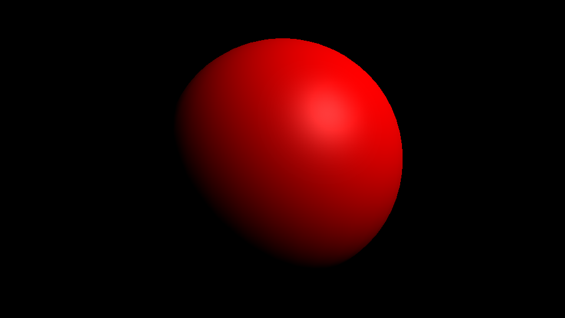
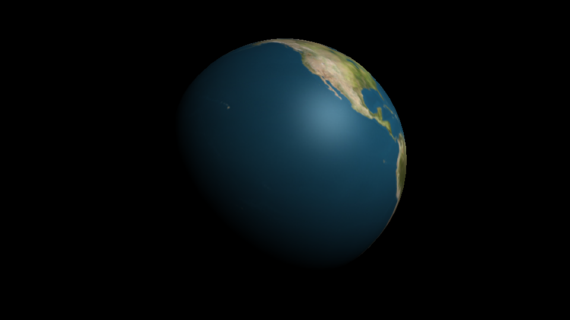

# Three.jsのマテリアルの基本

3Dの見栄えを決定するマテリアルとライティングについて説明します。


## マテリアルとは

マテリアルとは物体の質感設定のことです。3Dで形状を作る際には、見栄えを決める「マテリアル」を指定することで、例えば着色したり、画像を貼付けたり、陰影を付けたり、ライティングの反射などを適用することができます。


代表的なマテリアルとして「単色塗りのマテリアル」と「画像を使ったマテリアル」の二種類があります。どちらも`THREE.MeshPhongMaterial`クラスを使用しますが、コンストラクタの引数に色(16進数表記の色)か画像テクスチャを指定するかで自動的にそれに適したマテリアルになります。

## マテリアルを実装してみる

具体的にJavaScriptで実装してみましょう。Three.jsのライブラリを準備した後、次のスクリプトを貼付けてブラウザで確認ください。

```js
// ページの読み込みを待つ
window.addEventListener('load', init);

// サイズを指定
const width = 960;
const height = 540;

function init() {
  // レンダラーを作成
  const renderer = new THREE.WebGLRenderer({
    canvas: document.querySelector('#myCanvas')
  });
  renderer.setSize(width, height);

  // シーンを作成
  const scene = new THREE.Scene();

  // カメラを作成
  const camera = new THREE.PerspectiveCamera(45, width / height, 1, 10000);
  camera.position.set(0, 0, +1000);

  // 球体を作成
  const geometry = new THREE.SphereGeometry(300, 30, 30);
  const material = new THREE.MeshPhongMaterial({color: 0xFF0000});
  // メッシュを作成
  const mesh = new THREE.Mesh(geometry, material);
  // 3D空間にメッシュを追加
  scene.add(mesh);

  // 平行光源
  const directionalLight = new THREE.DirectionalLight(0xFFFFFF);
  directionalLight.position.set(1, 1, 1);
  // シーンに追加
  scene.add(directionalLight);

  tick();

  // 毎フレーム時に実行されるループイベントです
  function tick() {
    // メッシュを回転させる
    mesh.rotation.y += 0.01;
    // レンダリング
    renderer.render(scene, camera);

    requestAnimationFrame(tick);
  }
}
```

すると次の球体が作成されたと思います。



- [サンプルを再生する](https://ics-creative.github.io/tutorial-three/samples/material_color.html)
- [サンプルのソースコードを確認する](../samples/material_color.html)


Three.jsのオブジェクトの作成手順として(1)マテリアルを作成 (2)ジオメトリを作成 (3)メッシュを作成という3つの手順を踏むことになります。上の例では`THREE.SphereGeometry`(球体の形状)と`THREE.MeshPhongMaterial`クラスのインスタンスを作成したあとに、`THREE.Mesh`クラスのコンストラクタにそれぞれを指定しています。

```js
// 球体を作成
const geometry = new THREE.SphereGeometry(300, 30, 30);
// マテリアルを作成
const material = new THREE.MeshPhongMaterial({color: 0xFF0000});
// メッシュを作成
const mesh = new THREE.Mesh(geometry, material);
// 3D空間にメッシュを追加
scene.add(mesh);
```

ライティングがないと陰影がなく3Dの質感がわからないため、上記のスクリプトでは冒頭で`THREE.DirectionalLight`クラスのインスタンスを作成しています。`THREE.DirectionalLight`クラスは指定した方向からライトを適用することができます。これを**平行光源**といいます。


```js
// 平行光源
const directionalLight = new THREE.DirectionalLight(0xFFFFFF);
directionalLight.position.set(1, 1, 1);
// シーンに追加
scene.add(directionalLight);
```

## ライティングについて

Three.jsで使用できるライティングには以下の種類があります。

### THREE.DirectionalLight クラス
    
平行光源。ライトの位置と方向を指定し平行に到達する光として使用できます。

### THREE.AmbientLight クラス

環境光。空間全体を照らす光として使用できます。

今回はDirectionalLightのみを使用しています。

## 画像をマテリアルに使用する方法

おそらく一番使用頻度が高いと思われれるのが、画像を使ったマテリアルです。画像はGPUの制約から、2の累乗の高さ・幅である画像のみが利用できます。

なお、画像は[Planet Earth Texture Maps](http://planetpixelemporium.com/earth.html)の低解像度の画像(フリー)がお勧めで、今回はこれを使います。

準備ができましたら次のJavaScriptを使って試してみましょう。

```js
// ページの読み込みを待つ
window.addEventListener('load', init);

// サイズを指定
const width = 960;
const height = 540;

function init() {
  // レンダラーを作成
  const renderer = new THREE.WebGLRenderer({
    canvas: document.querySelector('#myCanvas')
  });
  renderer.setSize(width, height);

  // シーンを作成
  const scene = new THREE.Scene();

  // カメラを作成
  const camera = new THREE.PerspectiveCamera(45, width / height, 1, 10000);
  camera.position.set(0, 0, +1000);

  // 球体を作成
  const geometry = new THREE.SphereGeometry(300, 30, 30);
  // 画像を読み込む
  const loader = new THREE.TextureLoader();
  const texture = loader.load('imgs/earthmap1k.jpg');
  // マテリアルにテクスチャーを設定
  const material = new THREE.MeshPhongMaterial({
    map: texture
  });
  // メッシュを作成
  const mesh = new THREE.Mesh(geometry, material);
  // 3D空間にメッシュを追加
  scene.add(mesh);

  // 平行光源
  const directionalLight = new THREE.DirectionalLight(0xFFFFFF);
  directionalLight.position.set(1, 1, 1);
  // シーンに追加
  scene.add(directionalLight);

  tick();

  // 毎フレーム時に実行されるループイベントです
  function tick() {
    // メッシュを回転させる
    mesh.rotation.y += 0.01;
    // レンダリング
    renderer.render(scene, camera);

    requestAnimationFrame(tick);
  }
}
```

画像を使うには読み込み処理を作る必要があります。`THREE.TextureLoader`クラスを使って次のようにファイルパスを指定します。

```js
// 画像を読み込む
const loader = new THREE.TextureLoader();
const texture = loader.load('imgs/earthmap1k.jpg');
// マテリアルにテクスチャーを設定
const material = new THREE.MeshPhongMaterial({
  map: texture
});
```




- [サンプルを再生する](https://ics-creative.github.io/tutorial-three/samples/material_texture.html)
- [サンプルのソースコードを確認する](../samples/material_texture.html)


わかりやすいように変数に格納して記述しましたが、コンパクトに書きたい場合は次のように記述できます。処理内容はさきほどと同じです。

```js
// マテリアルにテクスチャーを設定
const material = new THREE.MeshPhongMaterial({
  map: new THREE.TextureLoader().load('imgs/earthmap1k.jpg')
});
```


## まとめ

今回のチュートリアルでは、マテリアルとライティングについての解説を行いました。3Dオブジェクトの見栄えを構成する要素のため、コーディングの結果がすぐに見た目に反映され、3Dのプログラミングにおいてとても楽しい部分です。ぜひサンプルを元に色々と試してみてください。

次は様々な基本的な形状の作成方法を説明します。

[次の記事へ](geometry_general.md)


<article-author>[池田 泰延](https://twitter.com/clockmaker)</article-author>
<article-date-published>2017-11-02</article-date-published>
<article-date-modified>2017-11-06</article-date-modified>
