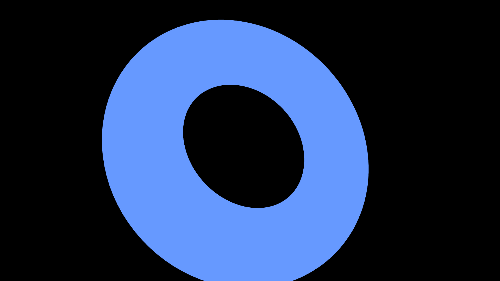
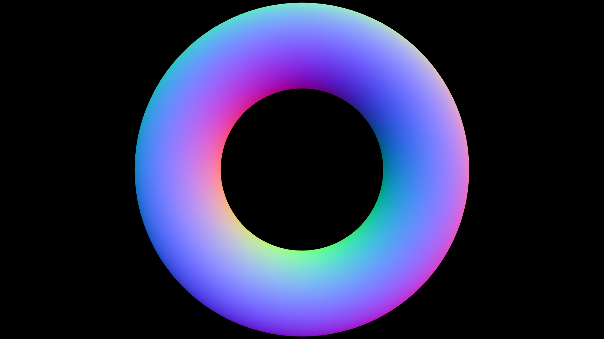
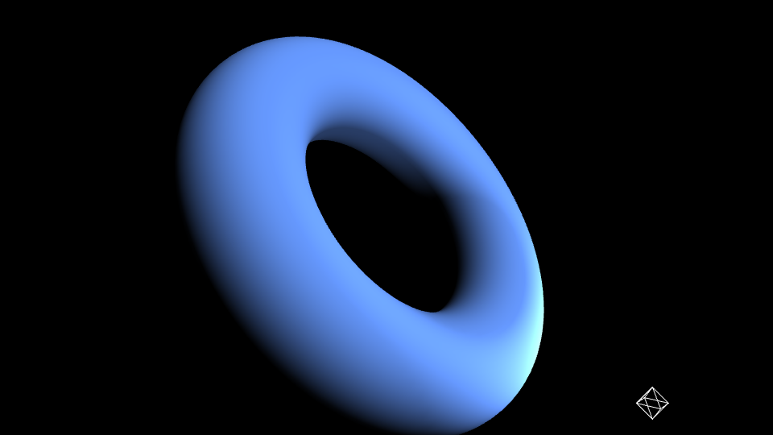
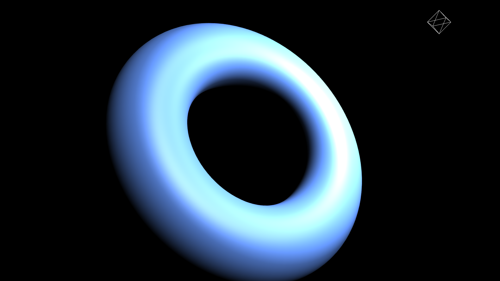
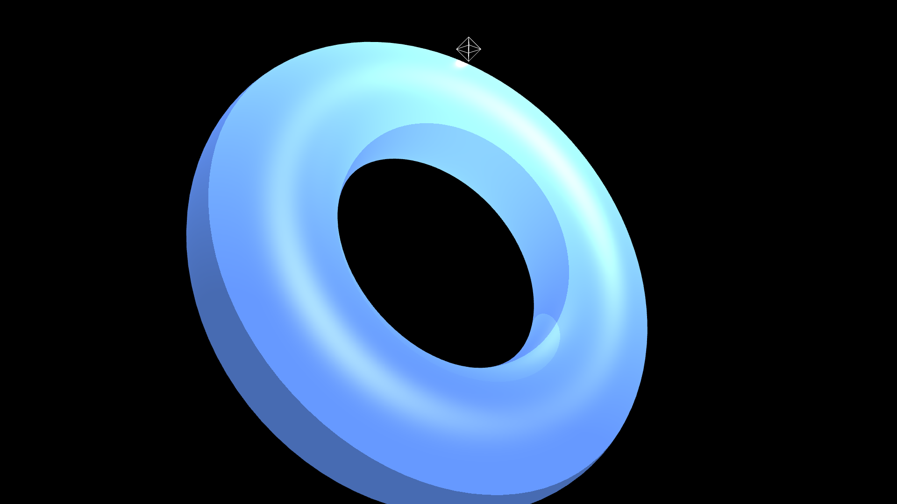
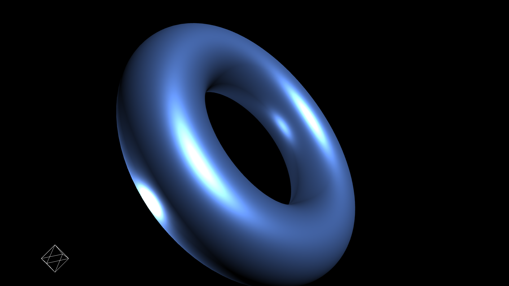

3Dの見栄えを決定するマテリアルについて説明します。

## MeshBasicMaterial



- [サンプルを再生する](https://ics-creative.github.io/tutorial-three/samples/material_variation_basic.html)
- [サンプルのソースコードを確認する](../samples/material_variation_basic.html)


`THREE.MeshBasicMaterial`クラスはライティングを考慮しないマテリアルです。**陰がつかないので均一な塗りつぶした状態**になります。開発中にライティングを無視して、動作確認するときに役立つでしょう。

このクラスのサンプルコードを抜粋して紹介します。

```js
// ドーナツを作成
const geometry = new THREE.TorusGeometry(300, 100, 64, 100);
// マテリアルを作成
const material = new THREE.MeshBasicMaterial({color: 0x6699FF});
// メッシュを作成
const mesh = new THREE.Mesh(geometry, material);
// 3D空間にメッシュを追加
scene.add(mesh);
```

このクラスの詳細な使い方は公式ドキュメント「[MeshBasicMaterial](https://threejs.org/docs/#api/materials/MeshBasicMaterial)」を参照ください。


## MeshNormalMaterial



- [サンプルを再生する](https://ics-creative.github.io/tutorial-three/samples/material_variation_normal.html)
- [サンプルのソースコードを確認する](../samples/material_variation_normal.html)


`THREE.MeshNormalMaterial`クラスはノーマルのカラーをRGBで可視化するマテリアルです。ライティングを必要としないため、手軽に動作確認するときに役立つでしょう。

このクラスのサンプルコードを抜粋して紹介します。

```js
// ドーナツを作成
const geometry = new THREE.TorusGeometry(300, 100, 64, 100);
// マテリアルを作成
const material = new THREE.MeshBasicMaterial({color: 0x6699FF});
// メッシュを作成
const mesh = new THREE.Mesh(geometry, material);
// 3D空間にメッシュを追加
scene.add(mesh);
```

このクラスの詳細な使い方は公式ドキュメント「[MeshNormalMaterial](https://threejs.org/docs/#api/materials/MeshNormalMaterial)」を参照ください。


## MeshLambertMaterial



- [サンプルを再生する](https://ics-creative.github.io/tutorial-three/samples/material_variation_lambert.html)
- [サンプルのソースコードを確認する](../samples/material_variation_lambert.html)


`THREE.MeshLambertMaterial`クラスはランバート・シェーディングと言う、光沢感のないマットな質感を表現できるマテリアルです。陰がでるため奥行き感を表現できます。陰影を必要とするマテリアルなので、ライトが必要となります。

このクラスのサンプルコードを抜粋して紹介します。

```js
// ドーナツを作成
const geometry = new THREE.TorusGeometry(300, 100, 64, 100);
// マテリアルを作成
const material = new THREE.MeshLambertMaterial({color: 0x6699FF});
// メッシュを作成
const mesh = new THREE.Mesh(geometry, material);
// 3D空間にメッシュを追加
scene.add(mesh);
```
※このマテリアルをつかう時はライトを用意ください。

このクラスの詳細な使い方は公式ドキュメント「[MeshLambertMaterial](https://threejs.org/docs/#api/materials/MeshLambertMaterial)」を参照ください。サンプルでさまざまなプロパティーを試せます。


## MeshPhongMaterial



- [サンプルを再生する](https://ics-creative.github.io/tutorial-three/samples/material_variation_phong.html)
- [サンプルのソースコードを確認する](../samples/material_variation_phong.html)


`THREE.MeshPhongMaterial`クラスはフォン・シェーディングと言う、光沢感のある質感を表現できるマテリアルです。

このクラスのサンプルコードを抜粋して紹介します。

```js
// ドーナツを作成
const geometry = new THREE.TorusGeometry(300, 100, 64, 100);
// マテリアルを作成
const material = new THREE.MeshPhongMaterial({color: 0x6699FF});
// メッシュを作成
const mesh = new THREE.Mesh(geometry, material);
// 3D空間にメッシュを追加
scene.add(mesh);
```

※このマテリアルをつかう時はライトを用意ください。

このクラスの詳細な使い方は公式ドキュメント「[MeshPhongMaterial](https://threejs.org/docs/#api/materials/MeshPhongMaterial)」を参照ください。サンプルでさまざまなプロパティーを試せます。


## MeshToonMaterial



- [サンプルを再生する](https://ics-creative.github.io/tutorial-three/samples/material_variation_toon.html)
- [サンプルのソースコードを確認する](../samples/material_variation_toon.html)


`THREE.MeshToonMaterial`クラスはアニメのようなトゥーンシェーディングを実現できるマテリアルです。`MeshPhongMaterial`クラスの拡張として用意されています。

このクラスのサンプルコードを抜粋して紹介します。

```js
// ドーナツを作成
const geometry = new THREE.TorusGeometry(300, 100, 64, 100);
// マテリアルを作成
const material = new THREE.MeshToonMaterial({color: 0x6699FF});
// メッシュを作成
const mesh = new THREE.Mesh(geometry, material);
// 3D空間にメッシュを追加
scene.add(mesh);
```

※このマテリアルをつかう時はライトを用意ください。

このクラスの詳細な使い方は公式ドキュメント「[MeshToonMaterial](https://threejs.org/docs/#api/materials/MeshToonMaterial)」を参照ください。


## MeshStandardMaterial



- [サンプルを再生する](https://ics-creative.github.io/tutorial-three/samples/material_variation_standard.html)
- [サンプルのソースコードを確認する](../samples/material_variation_standard.html)


`THREE.MeshStandardMaterial`クラスは物理ベースレンダリングのマテリアルです。物理ベースレンダリングは多くの3Dアプリケーションで実装されているもので（UnityやUnrealなど）、光の反射や散乱など現実の物理現象を再現します。先述の`MeshPhongMaterial`や`MeshLambertMaterial`よりも調整できることが多く、現実味のある表現ができます。


`roughness`プロパティーの値によって、光沢感の有無を調整できます。`0`のときは光沢の質感、`1`のときはマットな質感になります。

このクラスのサンプルコードを抜粋して紹介します。

```js
// ドーナツを作成
const geometry = new THREE.TorusGeometry(300, 100, 64, 100);
// マテリアルを作成
const material = new THREE.MeshStandardMaterial({color: 0x6699FF, roughness:0.5});
// メッシュを作成
const mesh = new THREE.Mesh(geometry, material);
// 3D空間にメッシュを追加
scene.add(mesh);
```

※このマテリアルをつかう時はライトを用意ください。

このクラスの詳細な使い方は公式ドキュメント「[MeshStandardMaterial](https://threejs.org/docs/#api/materials/MeshStandardMaterial)」を参照ください。サンプルでさまざまなプロパティーを試せます。


## まとめ

今回のチュートリアルでは、Three.jsが用意するさまざまなマテリアルについて紹介しました。プロパティーによってさまざまな表現ができるため色々試してみてください。

