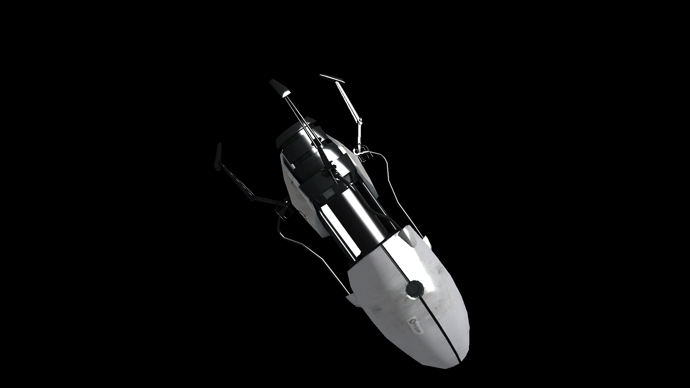

**3Dモデリングソフトで制作したモデルデータの読み込み方**を説明します。3Dのモデルデータにはさまざまな形式が存在しますが、Three.jsは対応している形式がです。

Three.jsでは外部ソフトを利用して作成した3Dモデリングデータを読み込むことができます。Three.jsではファイルを読み込むときにローダー（ファイルを解析する機能）を使ってモデルデータを読み込みます。 

### Three.jsが対応するモデルデータの形式

Three.jsでは次の形式の読み込みに対応しています。

* OBJ形式 : Wavefront社のAdvanced Visualizerというソフト用のファイルフォーマット。テキストデータ。 
* Collada(dae)形式 : 汎用的なデータファイル。XMLで構成されている。
* FBX形式（バイナリー）
* 3DMax (.3ds)形式 : Autodesk 3ds Maxの出力フォーマットとして使われるデータ形式。 
* Quake 2 MD2(.md2)形式 : Id Software'sがQuake II用に作成したファイルフォーマット。 
* BlenderからThree.js Exporterを使って出力したJSON形式


### Three.jsでの読み込み方

Three.jsでモデルデータを読み込むには、JavaScriptでThree.jsの初期化を済ませたあとで、ローダーを使ってファイルを読み込み、3D空間に追加するという手順をとります。

データ形式ごとにローダークラスが用意されています。ただ、ローダークラスは、Three.jsライブラリの本体に含まれていないので注意が必要です。公式GitHubの`examples/js/loader`フォルダーにJavaScriptファイルがあるので、これを`script`要素で読み込みます。作業用フォルダーにローダー関連のファイルをコピーしておきましょう。


### 3dsファイルの場合

3dsファイルの場合を読み込むには`TDSLoader.js`ファイルが必要となります。

```html
<script src="js/loader/TDSLoader.js"></script>
```

読み込む処理は次のように記載します。`THREE.TDSLoader`クラスのインスタンスから、`load`メソッドを利用します。
第一引数にはファイルパスを指定し、第二引数に読み込み後のコールバック関数を指定します。コールバック関数内で3D空間への追加処理をするのがポイントです。

なお、3dsファイルのテクスチャーのパスがずれないように、`setPath`メソッドを使って、明示的にテクスチャーが含まれるフォルダーのパスを指定します。

```js
// 3DS形式のモデルデータを読み込む
const loader = new THREE.TDSLoader();
// テクスチャーのパスを指定
loader.setPath('models/3ds/portalgun/textures/');
// 3dsファイルのパスを指定
loader.load('models/3ds/portalgun/portalgun.3ds',  (object) => {
  // 読み込み後に3D空間に追加
  scene.add(object);
});
```

このコードの実行結果は次のとなります。



- [サンプルを再生する](https://ics-creative.github.io/tutorial-three/samples/loader_3ds.html)
- [サンプルのソースコードを確認する](../samples/loader_3ds.html)

### Daeファイルの場合

daeファイルの場合を読み込むには`ColladaLoader.js`ファイルが必要となります。

```html
<script src="js/loader/ColladaLoader.js"></script>
```

読み込む処理は次のように記載します。`THREE.ColladaLoader`クラスのインスタンスから、`load`メソッドを利用します。
第一引数にはファイルパスを指定し、第二引数に読み込み後のコールバック関数を指定します。コールバック関数内で3D空間への追加処理をするのがポイントです。Colladaファイルにはシーンの情報の他に、カメラやライトなどさまざまな情報が含まれます。そのため、コールバック関数の引数から、シーンの情報だけ抜き出すようにしましょう。

```js
// 3DS形式のモデルデータを読み込む
const loader = new THREE.ColladaLoader();
// 3dsファイルのパスを指定
loader.load('./models/collada/elf/elf.dae', (collada) => {
  // 読み込み後に3D空間に追加
  const model = collada.scene;
  scene.add(model);
});
```

このコードの実行結果は次のとなります。


- [サンプルを再生する](https://ics-creative.github.io/tutorial-three/samples/loader_dae.html)
- [サンプルのソースコードを確認する](../samples/loader_dae.html)

### まとめ

今回はモデルデータの読み込み方について説明しました。JavaScriptだけのコードだとどうしても表現がプログラミングアートよりになってしまうため、モデルデータを使った方が表現のバリエーションを増やせます。とくにキャラクターや建築物、物体の表示にはモデルデータの読み込みがかかせません。

