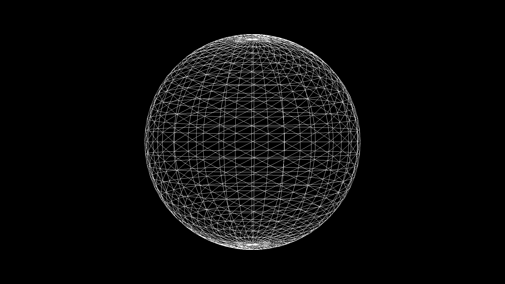

オフスクリーンキャンバスはWorkerスレッドで描画処理を行える機能です。負荷の高い描画処理をWorkerスレッドに移動することで、メインスレッドの負担が軽くなり、余裕ができます。これによりメインスレッドでスムーズなユーザー操作を実現できるようになり、ユーザー体験の向上が期待できます。具体的には、`canvas`の描画処理が大きかった場合にオフスクリーンキャンバスを使うと、ボタンクリック時の反応やCSSアニメーションが滑らかになるでしょう。

Three.jsでもオフスクリーンキャンバスを利用できます。複雑なことをしなければ難しくなく、通常のThree.jsのコードに少しの実装を追加するだけで実現できます。

オフスクリーンキャンバスの機能については、記事「[オフスクリーンキャンバスを使ったJSのマルチスレッド描画 – スムーズなユーザー操作実現の切り札](https://ics.media/entry/19043)」で詳しく解説しています。この解説を読み進める前に一読ください。


## Three.jsでの使い方

ワーカーを利用するにあたって、メインスレッド側とワーカー側と処理を分離する必要があります。これはファイル単位で分けなければなりません。まずはメインスレッド側のコードを紹介します。HTMLに`canvas`要素を配置し、JavaScriptでは`canvas`要素のオフスクリーン用オブジェクトを取得します。ワーカーインスタンスで投げてしまいます。


- [サンプルを再生する](https://ics-creative.github.io/tutorial-three/samples/osc_simple.html)
- サンプルのソースコードを確認する
  - [メインスレッド側](../samples/osc_simple.html)
  - [ワーカー側](../samples/osc_simple_worker.js)


### メインスレッド側

```html
<canvas id="myCanvas"></canvas>
```

```js
// 普通のキャンバスを取得
const canvasElement = document.querySelector('#myCanvas');
// オフスクリーンキャンバスを取得
const offscreenCanvas = canvasElement.transferControlToOffscreen();
// ワーカーを起動
const worker = new Worker('osc_simple_worker.js');
// ワーカー側にオフスクリーンキャンバスを転送
worker.postMessage({ canvas: offscreenCanvas }, [offscreenCanvas]);
```

### ワーカー側

ワーカー側では、Three.jsを`importScripts()`メソッドを使って読み込みます。`importScripts()`メソッドはワーカーでのみ利用できる機能です。外部のJSファイルを読み込むことができます。

※ES Modules形式はワーカーで利用できないため注意ください。

```js
importScripts(
  'https://cdnjs.cloudflare.com/ajax/libs/three.js/105/three.min.js'
);
```

メインスレッド側からの起動コールを受信するために、`onmessage`イベントを監視します。ここに初期化処理を記述します。引数の`event.data`オブジェクトで、メインスレッド側からのデータを受け取れます。

```js
// メインスレッドから通達があったとき
onmessage = event => {
  // メインスレッドからオフスクリーンキャンバスを受け取る
  const canvas = event.data.canvas;
  // ・・・いろいろ処理
```

ひとつだけ注意しなければならないことがあります。Three.jsは内部で`canvas`要素の`style`属性にアクセスします。しかし、OffscreenCanvasはDOM要素ではないため、`style`属性を持ちません。Three.jsで使用する場合はランタイムエラーを避けるため、OffscreenCanvasオブジェクトに明示的に`style`プロパティを付加します。

```js
  // Three.jsのライブラリの内部で style.width にアクセスされてしまう
  // 対策しないと、エラーが発生するためダミーの値を指定
  canvas.style = { width: 0, height: 0 };
```

あとは普通にコードをかけばThree.jsが動きます。冒頭のコードを見て、呆気なさを感じてください。


## オフスクリーンキャンバスでの画像の使い方

オフスクリーンキャンバスで画像を使うには`ImageBitmap`オブジェクトを利用します。


- [サンプルを再生する](https://ics-creative.github.io/tutorial-three/samples/osc_imagebitmap.html)
- サンプルのソースコードを確認する
  - [メインスレッド側](../samples/osc_imagebitmap.html)
  - [ワーカー側](../samples/osc_imagebitmap_worker.js)


通常の`THREE.ImageLoader()`メソッドだとDOM APIの`Image`オブジェクト、つまり`img`タグが使われます。ワーカー側ではDOM APIが利用できないため、`img`タグで画像を読み込むことはできないのです。`ImageBitmap`オブジェクトでは、DOM APIの`Image`オブジェクトを使わずに画像データを扱えます。Three.jsでは`THREE.ImageBitmapLoader()`でファイルを読み込み、`ImageBitmap`インスタンスを`THREE.CanvasTexture`でテクスチャーへと変換します。あとは、適当なマテリアルにテクスチャーとして設定するだけです。

```js
// テクスチャーを読み込み
const texture = await new Promise(resolve => {
  new THREE.ImageBitmapLoader().load('imgs/earthmap1k.jpg', imageBitmap => {
    const texture = new THREE.CanvasTexture(imageBitmap);
    resolve(texture);
  });
});
// マテリアルを作成
const material = new THREE.MeshStandardMaterial({ map: texture });
```

上記のコードではawait/asyncの構文を使っています。オフスクリーンキャンバスが動作するような新しいブラウザーのバージョンであれば、ECMAScript 2017相当のJavaScriptは動作するはずです。

## オフスクリーンキャンバスでのリサイズの方法

通常のThree.jsのリサイズ処理は、記事「[リサイズ処理](renderer_resize.md)」を先に読んで学習しておいてください。その上で解説します。



- [サンプルを再生する](https://ics-creative.github.io/tutorial-three/samples/osc_resize.html)
- サンプルのソースコードを確認する
  - [メインスレッド側](../samples/osc_resize.html)
  - [ワーカー側](../samples/osc_resize_worker.js)


オフスクリーンキャンバスからだと、メインスレッド側のリサイズイベントを検知できません。メインスレッド側のリサイズイベントは、メインスレッド側で検知しなけばなりません。

たとえば、次のようなコードでワーカー側にリサイズイベントを通知します。ワーカー側では`worker.postMessage()`メソッドにより通達を受けますが、初期化なのかリサイズイベントなのか判断する手がかりが必要となります。引数には区別ができるように任意の`type`プロパティーを付与しています。

```js
// 普通のキャンバスを取得
const canvasElement = document.querySelector('#myCanvas');
// オフスクリーンキャンバスを取得
const offscreenCanvas = canvasElement.transferControlToOffscreen();
const worker = new Worker('osc_resize_worker.js');
worker.postMessage(
  {
    type: 'init', // 処理区別のために追加
    canvas: offscreenCanvas,
    width: innerWidth,
    height: innerHeight,
    devicePixelRatio: devicePixelRatio
  },
  [offscreenCanvas]
);

window.addEventListener('resize', event => {
  worker.postMessage({
    type: 'resize', // 処理区別のために追加
    width: innerWidth,
    height: innerHeight,
    devicePixelRatio: devicePixelRatio
  });
});
```

ワーカー側の処理では、任意の`type`プロパティーの値をみて、条件文で処理を分岐しています。

```js
let renderer;
let camera;

// メインスレッドから通達があったとき
onmessage = event => {
  switch (event.data.type) {
    case 'init':
      init(event);
      break;
    case 'resize':
      resize(event.data.width, event.data.height, event.data.devicePixelRatio);
      break;
  }
};
function init(event) {
  // ・・・初期化処理（省略）
}

function resize(width, height, devicePixelRatio) {
  // レンダラーのサイズを調整する
  renderer.setPixelRatio(devicePixelRatio);
  renderer.setSize(width, height);

  // カメラのアスペクト比を正す
  camera.aspect = width / height;
  camera.updateProjectionMatrix();
}
```

## 最後に

メインスレッド側だけでThree.jsを使うより、オフスクリーンキャンバス側でThree.jsを使う方が実装難易度は高くなります。メインスレッド側のUI反応の観点でエンドユーザーにとっての利点が大きいので、プロジェクトの性質に応じて工数対効果が得られるようであれば、採用してみるといいでしょう。