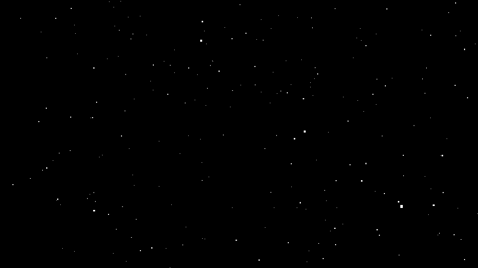

3D空間内に大量の粒子を表示させたい、星を表示させたい、塵を表示させたい。そんな表現に適しているのが`THREE.Point`クラスです。

この機能を使えば大量の粒子を表示でき、性能的にもすぐ入れているので実行性能をほとんど下げることなく利用できます。

3D空間にたくさんの粒子を配置するだけで、空間の距離感など雰囲気がでるので、オススメの機能のひとつです。

## パーティクルのサンプル



- [サンプルを再生する](https://ics-creative.github.io/tutorial-three/samples/points.html)
- [サンプルのソースコードを確認する](../samples/points.html)


## この機能の使い方

この機能を実現する部分を抜粋して解説します。


```js
// 形状データを作成
const SIZE = 3000;
// 配置する個数
const LENGTH = 1000;
// 頂点情報を格納する配列
const vertices = [];
for (let i = 0; i < LENGTH; i++) {
  const x = SIZE * (Math.random() - 0.5);
  const y = SIZE * (Math.random() - 0.5);
  const z = SIZE * (Math.random() - 0.5);

  vertices.push(x, y, z);
}

// 形状データを作成
const geometry = new THREE.BufferGeometry();
geometry.setAttribute('position', new THREE.Float32BufferAttribute(vertices, 3));

// マテリアルを作成
const material = new THREE.PointsMaterial({
  // 一つ一つのサイズ
  size: 10,
  // 色
  color: 0xffffff,
});

// 物体を作成
const mesh = new THREE.Points(geometry, material);
scene.add(mesh); // シーンは任意の THREE.Scene インスタンス
```


少し長いので難しく思いますが、コードの手順は次の通りです。

### ①頂点を格納する配列を作成する

```js
// 頂点情報を格納する配列
const vertices = [];
```

### ②ジオメトリーに頂点座標を加えていく

直方体エリア（一辺3000の距離）の中へランダムに1000個の粒子を配置します。`SIZE`と`LENGTH`変数で配置領域や個数をカスタマイズできるので、適宜調整ください。verticesは1次元の配列であり、頂点座標を`[x0, y0, z0, x1, y1, z1, x2, y2, z2]`と順番を登録していきます。


```js
// 頂点情報を格納する配列
const vertices = [];

// 形状データを作成
const SIZE = 3000;
// 配置する個数
const LENGTH = 1000;

const vertices = [];
for (let i = 0; i < LENGTH; i++) {
  const x = SIZE * (Math.random() - 0.5);
  const y = SIZE * (Math.random() - 0.5);
  const z = SIZE * (Math.random() - 0.5);

  vertices.push(x, y, z);
}
```

### ③頂点からジオメトリーを作成する

頂点座標を格納した配列`vertices`から、ジオメトリを作成します。`setAttribute()`メソッドを利用し登録します。

```js
// 形状データを作成
const geometry = new THREE.BufferGeometry();
geometry.setAttribute('position', new THREE.Float32BufferAttribute(vertices, 3));
```

### ④専用のマテリアルを作る

`THREE.PointsMaterial`という専用のクラスを使って、粒子のサイズや色を指定します。`THREE.PointsMaterial`クラスは形状を持たない為、視点が変化しても常に正面を向いて表示されます。

```js
// マテリアルを作成
const material = new THREE.PointsMaterial({
  // 一つ一つのサイズ
  size: 10,
  // 色
  color: 0xFFFFFF,
});
```
### ④手順3と5で作成したジオメトリーとマテリアルから、メッシュを作り、3D空間に配置する

```js
const mesh = new THREE.Points(geometry, material);
scene.add(mesh);
```


※ここで出て来た新しいクラスについては、詳しくは公式ドキュメント（英語）の「[Points](https://threejs.org/docs/#api/objects/Points)」と「[PointsMaterial](https://threejs.org/docs/#api/materials/PointsMaterial)」を確認ください。

