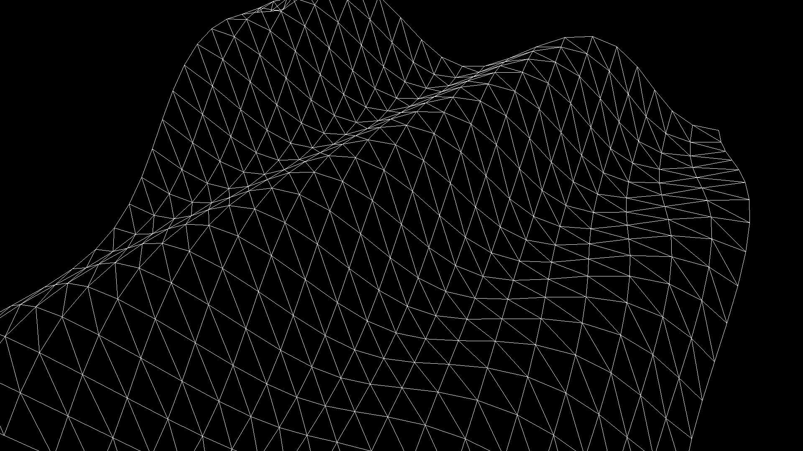
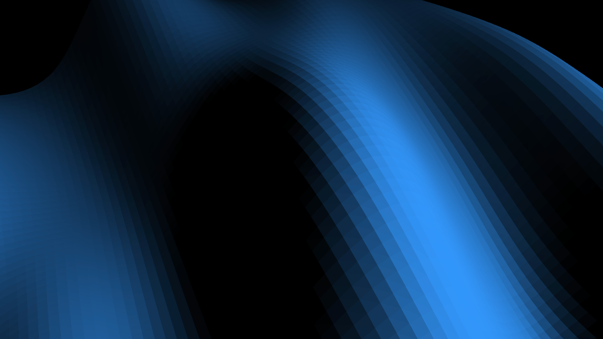
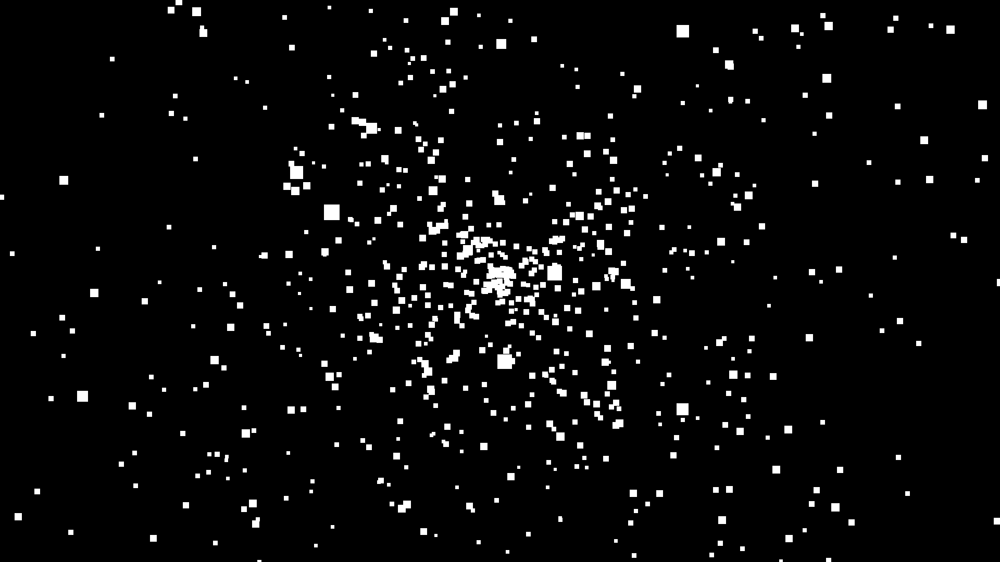

Three.jsではジオメトリを動かすことで表現をつくりたいことがあります。平面の`THREE.PlaneGeometry`を例に取り上げて、ジオメトリのいじり方を紹介します。


### 平面の頂点を動かす方法



- [サンプルを再生する](https://ics-creative.github.io/tutorial-three/samples/position_geometry.html)
- [サンプルのソースコードを確認する](../samples/position_geometry.html)


ジオメトリには`attributes.position`フィールドがあります。このフィールドからは`THREE.BufferAttribute`型のデータが得られます。`THREE.BufferAttribute`は、頂点座標情報を保持しています。

`THREE.BufferAttribute`は配列ではないオブジェクトであるため、少し使い方が特殊です。`count`プロパティーで頂点の数を取得できるので、`for`ループを使って頂点の数だけループ文を使うといいでしょう。
`getX()`、`getY()`、`getZ()`メソッドを使うことで、各頂点の位置情報を取得できます。

```js
// （省略）meshはTHREE.Meshインスタンス

// ジオメトリの頂点座標情報
/** @type {THREE.BufferAttribute} */
const position = mesh.geometry.attributes.position;

for (let i = 0; i < position.count; i++) {
  // 各頂点のXYZ座標
  const x = position.getX(i);
  const y = position.getY(i);
  const z = position.getZ(i);
  
  // ･･･
}
```

ここでは平面の各頂点におけるZ座標（平面における奥行きにあたる情報）を動かしてみます。

`setX()`、`setY()`、`setZ()`メソッドを使うことで、各頂点の位置情報を変更できます。変更した後には、`needsUpdate`プロパティーに`true`を設定し、Three.jsに更新の必要があることを認識させます。

```js
// 形状データを作成
const geometry = new THREE.PlaneGeometry(400, 400, 20, 20);

// マテリアルを作成
const material = new THREE.MeshBasicMaterial({ wireframe: true });

// 物体を作成
const mesh = new THREE.Mesh(geometry, material);
mesh.rotation.x = Math.PI / 2; // 地面らしい角度にする
scene.add(mesh);

tick();

// 毎フレーム時に実行されるループイベントです
function tick() {
  // （一部省略）

  // ジオメトリの頂点座標情報
  const position = mesh.geometry.attributes.position;
  for (let i = 0; i < position.count; i++) {
    // 各頂点のXYZ座標
    const x = position.getX(i);
    const y = position.getY(i);
    const z = position.getZ(i);

    // 高さを計算（PlaneGeometryの場合はZ座標）
    const nextZ = Math.sin(x * 0.03 + y * 0.02 + Date.now() * 0.002) * 30;

    position.setX(i, x); // xとyは変更していないので省略しても大丈夫
    position.setY(i, y);
    position.setZ(i, nextZ);
  }

  // 頂点の更新が必要なことを伝える
  position.needsUpdate = true;

  // レンダリング
  renderer.render(scene, camera);

  requestAnimationFrame(tick);
}
```

上記のコードでは、三角関数を使って時間の経過で奥行きを変化させました。動きが単調になるので、次のデモでは波のような動きを目指してみます。

### 平面の頂点に波のような動きをつける



- [サンプルを再生する](https://ics-creative.github.io/tutorial-three/samples/position_geometry_simplex.html)
- [サンプルのソースコードを確認する](../samples/position_geometry_simplex.html)


SimplexNoiseを使ってノイズを生成することで、地面のような表現をつくることができます。SimplexNoiseはThree.js本体には含まれていないものの、アドオンとして提供されているので次の`script`タグで読み込みます。


```html

<script type="importmap">
  {
    "imports": {
      "three": "https://cdn.jsdelivr.net/npm/three@0.167.0/build/three.module.js",
      "three/addons/": "https://cdn.jsdelivr.net/npm/three@0.167.0/examples/jsm/"
    }
  }
</script>
```

```js
import { SimplexNoise } from "three/addons/math/SimplexNoise.js";
```

利用する際は、`SimplexNoise`クラスからインスタンスを作成し、`noise()`メソッドを使います。`noise()`メソッドは、引数に数値を渡すと、-1から1の間の数値を返します。

```js
// ノイズを初期化
// インスタンスは使いますことが重要
const simplexNoise = new SimplexNoise();

const value = simplexNoise.noise(x1, y1); // x1とy1は任意の数値
```

次のようにPlaneGeometryの頂点の位置を変更することで、地面のような表現をつくることができます。

```js
// 平行光源を作成
const light1 = new THREE.DirectionalLight(0x3399ff, 1);
light1.position.set(1, 1, 1);
scene.add(light1);

// 形状データを作成
const geometry = new THREE.PlaneGeometry(1000, 1000, 80, 80);

// マテリアルを作成
const material = new THREE.MeshLambertMaterial({
  flatShading: true,
  side: THREE.DoubleSide,
});

// 物体を作成
const mesh = new THREE.Mesh(geometry, material);
mesh.rotation.x = Math.PI / 2; // 地面らしい角度にする
scene.add(mesh);

// ノイズを初期化
const simplexNoise = new SimplexNoise();

tick();
// 毎フレーム時に実行されるループイベントです
function tick() {
  // ポジションをかえる
  const position = mesh.geometry.attributes.position;
  for (let i = 0; i < position.count; i++) {
    // 各頂点のXYZ座標
    const x = position.getX(i);
    const y = position.getY(i);

    const time = Date.now() * 0.0001;

    // 高さを計算（PlaneGeometryの場合はZ座標）
    const nextZ = simplexNoise.noise(x * 0.002 + time, y * 0.001 + time) * 150;

    position.setZ(i, nextZ);
  }

  // 頂点の更新が必要なことを伝える
  position.needsUpdate = true;

  // （一部省略）
  
  // レンダリング処理等（省略）
}
```

### パーティクルの頂点を動かす

ジオメトリは平面だけでなく、さまざまなデータで利用できます。次のは`THREE.Points`で作成したパーティクルです。原点からパーティクルが飛び散るような演出として作成しています。




- [サンプルを再生する](https://ics-creative.github.io/tutorial-three/samples/points_position.html)
- [サンプルのソースコードを確認する](../samples/points_position.html)


これも`attributes.position`フィールドから頂点の位置を取得しています。`setXYZ()`は、頂点のXYZ位置をまとめて変更するメソッドです。`setXYZ()`の第一引数には頂点のインデックスを指定し、第二引数から第四引数にはXYZ座標を指定します。


```js
// ポジションをかえる
const position = mesh.geometry.attributes.position;
for (let i = 0; i < position.count; i++) {
  // 各頂点のXYZ座標
  const x = position.getX(i);
  const y = position.getY(i);
  const z = position.getZ(i);

  // speeds配列は速度用の配列。各頂点の速度を格納している
  const nextX = x + speeds[i].x;
  const nextY = y + speeds[i].y;
  const nextZ = z + speeds[i].z;

  // 新しい座標
  position.setXYZ(i, nextX, nextY, nextZ);

  // 原点からの距離を計算
  const length = new THREE.Vector3(x, y, z).length();
  // 一定の範囲を超えたら
  if (length > 100) {
    // 原点に戻す
    position.setXYZ(i, 0, 0, 0);
  }
}

// 頂点の更新が必要なことを伝える
position.needsUpdate = true;
```

`setXYZ()`メソッドでなくても、個別に`setX()`、`setY()`、`setZ()`メソッドを使っても同じことができます。

```js
// 新しい座標
position.setX(i, nextX);
position.setY(i, nextY);
position.setZ(i, nextZ);
```