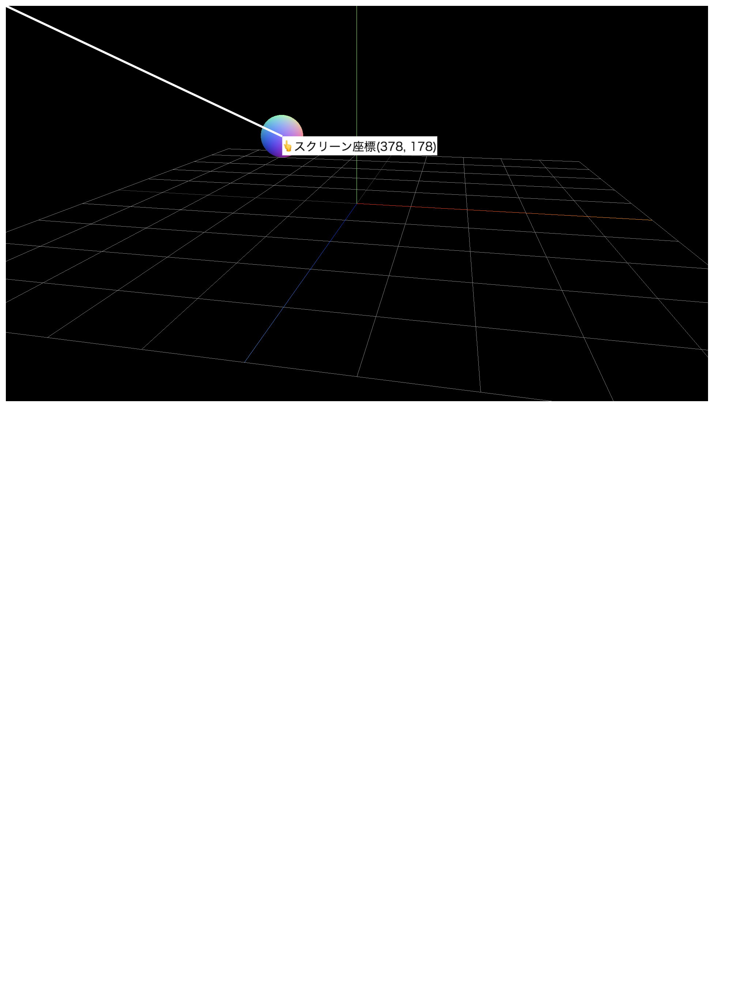

Three.jsの`canvas`要素にHTMLの表示を重ねたい時があります。

そのときに必要となるのが、canvas要素上のオブジェクトの座標です。これは、描写面である`canvas`要素上の座標のことなので、スクリーン座標と言います。


## スクリーン座標の算出方法

`THREE.Camera`クラスの`project()`メソッドを使うことで、ワールド座標をステージ上のXY座標に変換できます。


```js
const project = object3D.project(camera);
```

`project()`メソッドの戻り値は`THREE.Vector3D`型で、`x`と`y`はそれぞれ`-1.0`～`+1.0`の値をとります。`z`は3Dオブジェクトの深度を示します。


2D座標の取得には、`renderer`インスタンスの幅・高さの値を計算することで`canvas`要素の左上からの座標を求めることができます。


```js
const object3D = new Mesh(); // 任意の3Dオブジェクト
const width = 960; // rendererのサイズ
const height = 540;

// スクリーン座標を取得する
const project = object3D.position.project(camera);
const sx = width / 2 * (+project.x + 1.0);
const sy = height / 2 * (-project.y + 1.0);

// スクリーン座標
console.log(sx, sy);
```

## スクリーン座標算出のサンプル

次のサンプルは球体が3D空間内を円周上を移動している様子を表現したものですが、球体のスクリーン座標をテキストで表示するようにしています。



- [サンプルを再生する](https://ics-creative.github.io/tutorial-three/samples/position_project.html)
- [サンプルのソースコードを確認する](../samples/position_project.html)


このサンプルでは`canvas`に重ねて任意の`div`要素を重ね合わせます。座標の原点をあわせておきたいので、CSSの`position:absolute`で2つの要素の絶対座標をリセットしておきます。親の`div`要素の原点を基点としたいので`position:relative`を指定します。

```HTML
<!-- 親のタグの基準点をリセット -->
<div style="position:relative;">
  <!-- Three.js用のcanvasタグ -->
  <canvas style="position: absolute; top: 0; left: 0;"></canvas>

  <!-- 座標表示用のdivタグ -->
  <div style="position: absolute; top: 0; left: 0;"></div>
</div>
```
