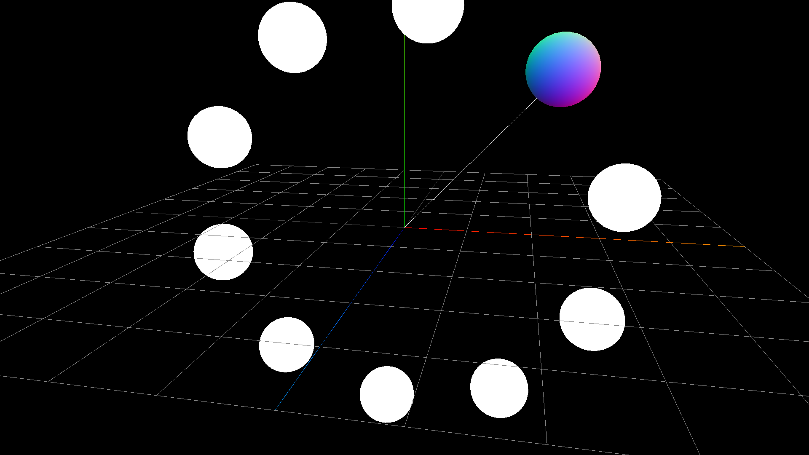

ワールド座標（空間座標）とは3D空間（`scene`）の原点から見た座標をワールド座標といいます。

Three.jsでは`getWorldPosition`メソッドを使って、ワールド座標を取得できます。この値は`THREE.Vector3`型なので、`x`、`y`、`z`プロパティーを使って座標を参照します。

## ワールド座標の算出方法

`THREE.Object3D`クラスの`getWorldPosition()`メソッドを使うことで、ワールド座標が得られます。

```js
const world = object3D.getWorldPosition();
```

##  ワールド座標算出のサンプル

次のサンプルは球体が3D空間内を円周上を移動している様子を表現したものです。球体はすべて`THREE.Group`クラスを使って入れ子構造にしています。

この状態で球体のワールド座標を取得しています。原点から色のついた球体まで線が伸びていることで、ワールド座標を扱えていることがわかります。



- [サンプルを再生する](https://ics-creative.github.io/tutorial-three/samples/position_world.html)
- [サンプルのソースコードを確認する](../samples/position_world.html)

ワールド座標を使えば、スクリーン座標の算出に役立ちます。詳しは次の記事を御覧ください。

- [スクリーン座標の算出方法](position_project.md)

