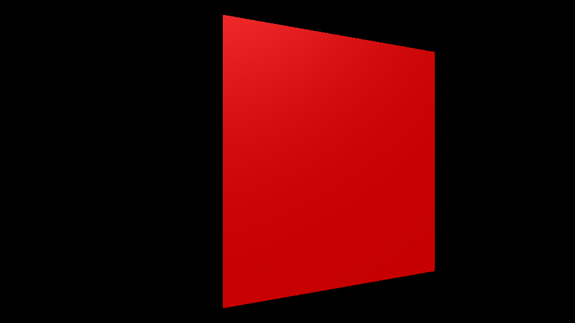

[Three.js](http://typescript.Three.js.com/)はHTMLの3D技術「[WebGL](http://ja.wikipedia.org/wiki/WebGL "WebGL - Wikipedia")」を扱いやすくしたフレームワークです。**Three.jsを使えばGPUによる本格的な3D表現をプラグイン無しで作成**できます。


ライブラリのセットアップから3D画面への表示および直方体の回転までを紹介します。手順通りに進めば、20分くらいで作業が完了できると思います。



- [サンプルを再生する](https://ics-creative.github.io/tutorial-three/samples/quickstart.html)
- [サンプルのソースコードを確認する](../samples/quickstart.html)


まずはHTMLファイルを用意して、次のコードを貼り付けて試してください。

```html
<!DOCTYPE html>
<html>
<head>
  <meta charset="utf-8"/>
  <script src="https://cdnjs.cloudflare.com/ajax/libs/three.js/105/three.min.js"></script>
  <script>
    // ページの読み込みを待つ
    window.addEventListener('load', init);

    function init() {

      // サイズを指定
      const width = 960;
      const height = 540;

      // レンダラーを作成
      const renderer = new THREE.WebGLRenderer({
        canvas: document.querySelector('#myCanvas')
      });
      renderer.setPixelRatio(window.devicePixelRatio);
      renderer.setSize(width, height);

      // シーンを作成
      const scene = new THREE.Scene();

      // カメラを作成
      const camera = new THREE.PerspectiveCamera(45, width / height);
      camera.position.set(0, 0, +1000);

      // 箱を作成
      const geometry = new THREE.BoxGeometry(400, 400, 400);
      const material = new THREE.MeshNormalMaterial();
      const box = new THREE.Mesh(geometry, material);
      scene.add(box);

      tick();

      // 毎フレーム時に実行されるループイベントです
      function tick() {
        box.rotation.y += 0.01;
        renderer.render(scene, camera); // レンダリング

        requestAnimationFrame(tick);
      }
    }
  </script>
</head>
<body>
  <canvas id="myCanvas"></canvas>
</body>
</html>
```

ブラウザの画面上に単色の直方体が回転します。

ちなみに前提としてThree.jsはWebGL対応のブラウザが必須となりますので、動作確認はFirefoxやChrome、Safari、Edgeなどを使うといいでしょう。

また、WebGLはローカルファイルのセキュリティーの制限があるため、ローカルサーバー上で実行することをオススメします。ローカルサーバーの構築方法がわからなければ、記事『[VS Codeを使いこなせ\! フロントエンジニア必須の拡張機能7選](https://ics.media/entry/18544/)』で紹介している「Live Server」を利用しましょう。マウス操作で簡単にローカルサーバーを起動できるので簡単です。

ここからは、上記のコードを解説していくので、少しずつ理解していきましょう。

## canvas要素を用意する

Three.jsはHTML5の`canvas`要素を利用します。`canvas`要素はコンテンツを表示する描画エリアとなります。`canvas`要素には属性として`id`（ID値）を最低限設定しておきましょう。

```html
<body>
  <canvas id="myCanvas"></canvas>
</body>
```

`canvas`要素の大きさはJavaScriptを使って設定します。


## JSライブラリを読み込む

Three.jsはJavaScriptのライブラリですが、このファイルを読み込むことによってはじめてThree.jsが利用できるようになります。

CDN（コンテンツ・デリバリー・ネットワーク）で提供されているURLを使うのが導入にお手軽です。

```html
<script src="https://cdnjs.cloudflare.com/ajax/libs/three.js/105/three.min.js"></script>
```

WebGLの処理はページの読み込みが終わってから実行させます。`addEventListener()`関数を使って`load`イベントが発生するのを監視させ、ページが読み込み終わったときに実行させたい関数を指定します。この関数`init()`の中にThree.jsのコードを書いていきます。

```html
<script>
window.addEventListener('load', init);
function init(){
  // 処理
}
</script>
```

## 3D表示用のJavaScriptを用意

WebGLのレンダリングをするためのレンダラーを作成します。`THREE.WebGLRenderer`クラスのコンストラクターには引数として、HTMLに配置した`canvas`要素を指定し、連携させます。

```js
const renderer = new THREE.WebGLRenderer({
  canvas: document.querySelector('#myCanvas')
});

```

デフォルトではレンダラーのサイズが小さいため、`setSize()`メソッドでサイズを設定します。今回のデモでは幅960px、高さ540pxを設定しています。

```js
renderer.setSize(960, 540);
```


## シーンを作成する

シーンを作成します。シーンとは3D空間のことで、3Dオブジェクトや光源などの置き場となります。

```js
const scene = new THREE.Scene();
```

## カメラを作る

3Dではどの視点から空間を撮影するか、という実装をします。この機能は「視点」や「カメラ」と呼ばれます。

Three.jsでは`THREE.PerspectiveCamera`クラスのコンストラクターで画角、アスペクト比、描画開始距離、描画終了距離の4つの情報を引数として渡しカメラを作成します。

```js
// new THREE.PerspectiveCamera(画角, アスペクト比
const camera = new THREE.PerspectiveCamera(45, 960 / 540);
```

## 立方体を作る

立方体はメッシュという表示オブジェクトを使用して作成します。メッシュを作るには、ジオメトリ（形状）とマテリアル（素材）の二種類を用意する必要があります。

ジオメトリとは頂点情報や面情報を持っています。Three.jsにはさまざまなジオメトリが用意されていますが、今回は立方体や直方体のような箱状の形状を生成するための`BoxGeometry`を使用します。

```js
// new THREE.BoxGeometry(幅, 高さ, 奥行き)
const geometry = new THREE.BoxGeometry(500, 500, 500);
```

マテリアルは色や質感の情報を持っています。今回はとりあえず箱を表示させたいので、`THREE.MeshNormalMaterial`という適当なカラーを割り振るマテリアルを生成します。

```js
const material = new THREE.MeshNormalMaterial();
```

作成したジオメトリとマテリアルを使って、メッシュを作ります。作成したメッシュをシーンに追加しましょう。

```js
// new THREE.Mesh(ジオメトリ,マテリアル)
const box = new THREE.Mesh(geometry, material);
// シーンに追加
scene.add(box);

```


## アニメーション

JavaScriptでアニメーションをさせるには、時間経過で関数を呼び続ける必要があります。そのためには、`requestAnimationFrame()`というグローバルメソッドを使用します。`requestAnimationFrame()`は引数として渡された関数を、毎フレーム実行します。


```js
// 初回実行
tick();

function tick() {
  requestAnimationFrame(tick);

  // アニメーション処理をここに書く
}
```


次に、Three.jsの表示結果を更新する命令を書きます。Three.jsでは自動的に画面が最新に切り替わらないので、明示的に画面が更新されるように命令を書く必要があります。`renderer.render()`という命令で更新を指示できます。


```js
// 初回実行
tick();

function tick() {
  requestAnimationFrame(tick);

  // アニメーション処理をここに書く

  renderer.render(scene, camera); // レンダリング
}
```


アニメーションの処理として、立方体が回転するようにしてみましょう。時間経過で回転するように`rotation.y`プロパティの数値を加算しています。

```js
// 初回実行
tick();

function tick() {
  requestAnimationFrame(tick);

  // アニメーション処理をここに書く
  box.rotation.y += 0.01;
  renderer.render(scene, camera); // レンダリング
}
```

以上がサンプルの解説となります。

## Three.jsの基本構造

上記のコードで出現したThree.jsの基本機能について紹介します。


図：Three.jsを構成する基本的なオブジェクトと表示の仕組み
ビュー（HTMLの`canvas`タグ）が実際に表示される画面となります。


**THREE.Sceneクラス**

3Dの空間を表すクラス。3Dのオブジェクトはシーンに`add()`メソッドを利用して追加することで表示できます。

**THREE.PerspectiveCameraクラス**

3D空間を撮影するカメラ。視点を制御するために使用します。3D空間のどの視点で撮影しているのかの情報が必要となります。


**THREE.WebGLRendererクラス**

3D空間のレンダリングを行います。レンダリングとは、Three.jsで計算した3Dのオブジェクトを画面に表示することです。内部的にはThree.jsがWebGLのAPIを使って、GPUで座標を計算させ画面に表示させています。Three.jsでは`requestAnimationFrame`のタイミングにあわせて、レンダリングを行うように設定しましょう。


## まとめ

3Dと聞くと難しそうと思われがちですが、あっけなく動作したので驚かれた方も多いのではないでしょうか？


次回の記事では、マテリアルやライティングの設定方法を説明します。

[次の記事へ](material_basic.md)

