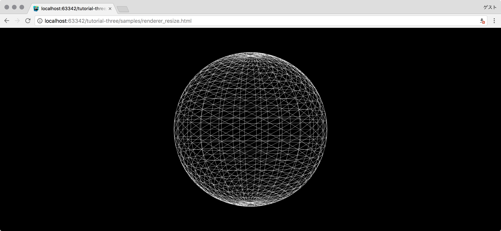
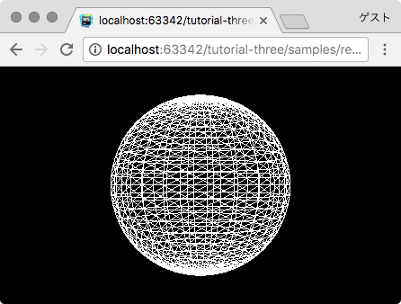
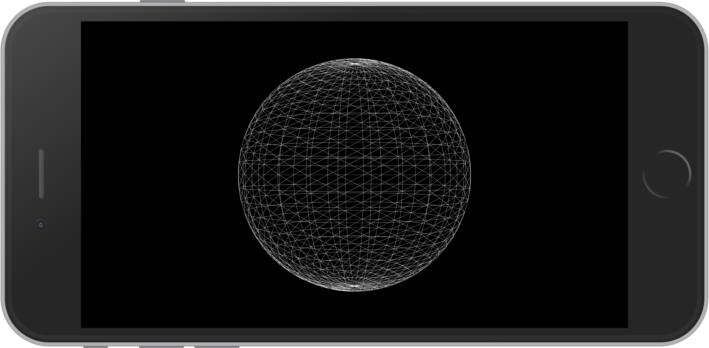

Three.jsでの最適なリサイズ処理の方法を紹介します。この手順を覚えれば次のような希望に対応できます。

- どんなディスプレイでもThree.jsを綺麗に見せたい
- 異なるディスプレイでも全画面に3Dを表示させたい
- ブラウザのサイズを変更してもThree.jsを全画面にフィットさせたい

## リサイズのサンプル

- [サンプルを再生する](https://ics-creative.github.io/tutorial-three/samples/renderer_resize.html)
- [サンプルのソースコードを確認する](../samples/renderer_resize.html)









## 設定方法

### HTMLのメタタグ

HTMLの`meta`タグに`viewport`の設定をします。

```html
<meta name="viewport" content="width=device-width, initial-scale=1"/>
```

スマートフォンのブラウザーには横幅の大きなPCサイトも柔軟に見れるよう、自動的に拡大縮小する機能があります。WebGLを綺麗に見せたいときには、その機能が余計な処お世話となります。

`width=device-width`と指定することでデバイスの最適な幅で表示させるようにします。また、初期状態で拡大・縮小していない見え方へするために`initial-scale=1`を指定します。

### スタイルシート

`body`タグに余白が存在するので、それを消すように`margin: 0`を指定します。

```html
<style>
  body {
    margin: 0;
    overflow: hidden;
  }
</style>
```

また、`overflow: hidden`を指定すると、macOSのデスクトップブラウザのオーバースクロール（たとえば画面上部にスクロールすると、画面上部を一瞬超えて表示される挙動）を抑制できます。全画面コンテンツを作るときにオーバースクロールの挙動は余計なお世話なので、`overflow: hidden`を指定しておきましょう。

### Three.jsの調整

`resize`イベントを監視し、画面サイズである`window.innerWidth`と`window.innerHeight`の値を使います。

```js
// 初期化のために実行
onResize();
// リサイズイベント発生時に実行
window.addEventListener('resize', onResize);

function onResize() {
  // サイズを取得
  const width = window.innerWidth;
  const height = window.innerHeight;

  // レンダラーのサイズを調整する
  renderer.setPixelRatio(window.devicePixelRatio);
  renderer.setSize(width, height);

  // カメラのアスペクト比を正す
  camera.aspect = width / height;
  camera.updateProjectionMatrix();
}
```

実装のポイントは次の通りです。

- リサイズ時にはレンダラーのサイズを`setSize`メソッドで画面幅に合わせること
- デスクトップでは、メインディスプレイ・サブディスプレイでPixelRatioの異なる可能性があるので、リサイズイベントで`setPixelRatio`メソッドでを使って更新するべき
- リサイズ時にはカメラの縦横比が狂うので、リサイズ時に縦横比を正しく調整する
- 画面サイズの設定処理は、初期化時もリサイズ時も同じ
  - `onResize`関数は初期化時とリサイズイベント発生の両方で呼び出す


以上となります。詳しくはサンプルのコードをコピーするなどして取り組んでください。
