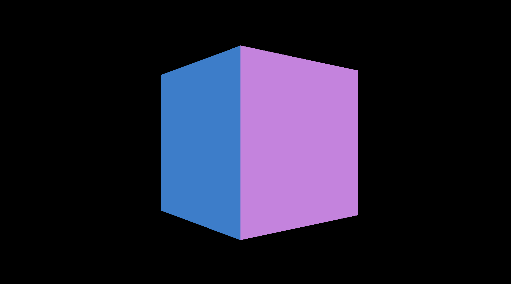

`WebGPURenderer` は、最新のWebグラフィックスAPIである WebGPU を利用して Three.js のシーンを描画するためのレンダラーです。
従来の `WebGLRenderer` と同様のインターフェースを持ちながら、WebGPU のパフォーマンス上の利点を活かすことができます。

## セットアップ

基本的なセットアップ手順は以下の通りです。

1.  **Three.js のインポート**: WebGPU 対応ビルド (`three.webgpu.js`) をインポートします。
2.  **レンダラーの作成**: `new THREE.WebGPURenderer()` でインスタンスを作成します。
3.  **初期化**: 非同期メソッド `renderer.init()` を呼び出してレンダラーを初期化します。`await` を使用する必要があります。
4.  **シーン、カメラ、オブジェクトの作成**: 通常通り、シーン、カメラ、メッシュなどを作成します。


## サンプルコード




- [サンプルを再生する](https://ics-creative.github.io/tutorial-three/samples/webgpu_renderer_cdn.html)
- [サンプルのソースコードを確認する](../samples/webgpu_renderer_cdn.html)


```html
<html>
<head>
  <meta charset="utf-8" />
  <script type="importmap">
    {
      "imports": {
        "three": "https://cdn.jsdelivr.net/npm/three@0.175.0/build/three.webgpu.js",
        "three/webgpu": "https://cdn.jsdelivr.net/npm/three@0.175.0/build/three.webgpu.js"
      }
    }
  </script>
  <script type="module">
    import * as THREE from "three";
    import { WebGPURenderer } from "three/webgpu";
    // サイズを指定
    const width = 960;
    const height = 540;

    // レンダラーを作成
    const renderer = new WebGPURenderer({
      canvas: document.querySelector("#myCanvas"),
    });
    renderer.setPixelRatio(window.devicePixelRatio);
    renderer.setSize(width, height);
    renderer.setClearColor(0x000000); // 背景色を指定
    await renderer.init(); // ★ WebGPU レンダラーの初期化 (非同期)

    // シーンを作成
    const scene = new THREE.Scene();

    // カメラを作成
    const camera = new THREE.PerspectiveCamera(45, width / height);
    camera.position.set(0, 0, +1000);

    // 箱を作成
    const geometry = new THREE.BoxGeometry(400, 400, 400);
    const material = new THREE.MeshNormalMaterial(); // 標準のマテリアルを使用
    const box = new THREE.Mesh(geometry, material);
    scene.add(box);

    tick();

    // 毎フレーム時に実行されるループイベントです
    function tick() {
      box.rotation.y += 0.01;
      renderer.render(scene, camera); // レンダリング

      requestAnimationFrame(tick);
    }
  </script>
</head>
<body>
<canvas id="myCanvas"></canvas>
</body>
</html>
```

このサンプルでは、`WebGPURenderer` を初期化し、基本的な立方体を描画しています。
主な注意点は `await renderer.init()` を呼び出す必要がある点です。


`WebGPURenderer`の使い方は、`WebGLRenderer`とほぼ同じであることが分かると思います。


## importmap によるモジュール解決

このサンプルでは、HTML の `<script type="importmap">` を使って ES モジュールの名前をビルド済みファイルの URL にマッピングしています。
以下のように設定することで、`three` と `three/webgpu` のインポート先を明示的に指定できます。

```html
<script type="importmap">
  {
    "imports": {
      "three": "https://cdn.jsdelivr.net/npm/three@0.175.0/build/three.webgpu.js",
      "three/webgpu": "https://cdn.jsdelivr.net/npm/three@0.175.0/build/three.webgpu.js"
    }
  }
</script>
```

上記の設定により、続く `<script type="module">` 内の次のコードは、自動的に WebGPU ビルド (`three.webgpu.js`) を読み込むようになります。これがないと、デフォルトの WebGL ビルドやローカル版の three.js が読み込まれるため、`WebGPURenderer` が見つからずエラーになります。


```js
import * as THREE from "three";
import { WebGPURenderer } from "three/webgpu";
```


なお、`"three"` と `"three/webgpu"` を別々に定義しているのは、TypeScript移植時の互換性のためです。TypeScriptでは、パスベースのインポート（`three/webgpu`）と名前空間インポート（`three`）を区別するため、両方のマッピングを提供することで、コードの移行をスムーズに行えます。

## WebGLRenderer との互換性について

`WebGPURenderer` は、従来の `THREE.WebGLRenderer` と同じコンストラクタオプションやメソッドを提供しており、既存の WebGLRenderer ベースのコードをほとんどそのまま置き換えて利用できます。

- コンストラクタオプション：
  - `canvas`（描画先の `<canvas>` 要素）
  - `antialias`など、WebGLRenderer と同様の設定が可能
- 主要メソッド：
  - `setSize(width, height)`, `setPixelRatio(ratio)`, `setClearColor(color)`
  - `render(scene, camera)` でシーンを描画
  - `dispose()` でリソースを破棄
- その他のプロパティや機能：
  - `outputColorSpace`, `toneMapping`, `physicallyCorrectLights`, `shadowMap` などの設定もほぼ同一です

## WebGPU非対応のブラウザでも利用できる

`WebGPURenderer` は、WebGPU をサポートしていないブラウザ環境でも動作するように設計されています。WebGPU が利用できない場合、自動的に **WebGL 2** レンダラーにフォールバックします。

これにより、開発者は最新の WebGPU API を活用しつつ、WebGPU 非対応のブラウザでもアプリケーションを実行できるため、幅広いユーザーにリーチできます。このフォールバック機能は Three.js によって自動的に処理されるため、開発者が特別な対応を行う必要はありません。
