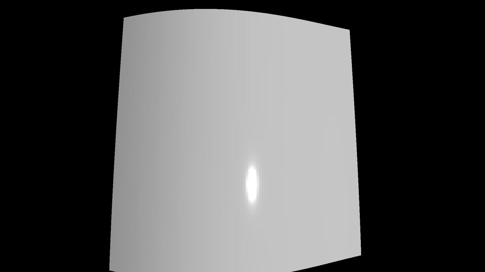

**TSL（Three.js Shading Language）** は、Three.js のマテリアルやシェーダーをノードベースで構築・カスタマイズできる高級言語です。  

GLSL を直接記述しなくても、JavaScript でノードを接続していくだけで複雑なシェーダー エフェクトを実装できます。特に WebGPU 環境では、ノードベースのマテリアル（`NodeMaterial`／`MeshStandardNodeMaterial` など）と TSL の組み合わせが強力です。

### WebGPU と WebGL の互換性

TSL は主に WebGPURenderer 向けに設計されていますが、WebGPU をサポートしないブラウザーでは自動的に **WebGL 2** へフォールバックできます。最新ハードウェアでは高性能な WebGPU の恩恵を得つつ、より多くのデバイスで動作する互換性も確保できます。

従来の WebGL では GLSL や **GLSL 3.0** を直接記述する必要があり、低レベルな知識とデバッグの手間が求められました。TSL は JavaScript 構文を用いて抽象化を提供し、シェーダー開発の複雑さを大幅に軽減します。

### TSLの主な特徴

1. **JavaScript／TypeScript での記述**  
   型定義が提供されているため、TypeScript を使うとコード補完や型チェックの恩恵を受けられます。

2. **ノードベースのアプローチ**  
   関数やオブジェクトをノードとして組み合わせ、計算グラフを構築します。ロジックを視覚的に把握しやすく、再利用性も高まります。

3. **ツリーシェイキング対応**  
   必要な機能だけをバンドルに含められるため、最終的な JavaScript バンドルサイズを最小化できます。

4. **自動生成**  
   ターゲットプラットフォーム（WebGPU または WebGL）に合わせてシェーダーコードを生成します。


## NodeMaterial と TSL

Three.js には、従来のマテリアル（`MeshBasicMaterial`／`MeshStandardMaterial` など）とは別に、ノードで計算グラフを構築できる **`NodeMaterial`** と、その拡張版である **`MeshStandardNodeMaterial`** などが用意されています。  
TSL はこれらのプロパティ（`positionNode`／`colorNode`／`normalNode` など）に計算ノードを接続することで、柔軟なカスタマイズを実現します。

- **`positionNode`** — 頂点シェーダーの最終出力位置を制御（頂点変位などに利用）  
- **`colorNode`** — フラグメントシェーダーの最終出力色を制御  
- **`normalNode`** — ライティング計算用の法線ベクトルを制御  

## セットアップ手順

1. **インポート**  
   - `three/webgpu` から `MeshStandardNodeMaterial`をインポート
   - `three/tsl` から各種 TSL ノードをインポート
2. **マテリアル作成**  
   ```js
   const material = new MeshStandardNodeMaterial();
   ```  
3. **TSL ノード構築**  
   `float()`, `vec3()`, `add()`, `mul()`, `sin()`, `time`, `uv()` など多彩なノードを組み合わせて計算グラフを構築。
4. **ノード接続**  
   作成したノードを `material.positionNode` や `material.normalNode` などへ代入します。

## サンプルコード

以下のコードは、`MeshStandardNodeMaterial` の PBR ライティングを保持しつつ、TSL で頂点変位と法線計算をカスタマイズする例です。




- [サンプルを再生する](https://ics-creative.github.io/tutorial-three/samples/webgpu_renderer_cdn_tsl.html)
- [サンプルのソースコードを確認する](../samples/webgpu_renderer_cdn_tsl.html)


特に注意したいのはimport文です。以下のように記載することで `"three/webgpu"` や `"three/tsl"`を利用できます。

```html
<html>
  <head>
    <meta charset="utf-8" />
    <script type="importmap">
      {
        "imports": {
          "three": "https://cdn.jsdelivr.net/npm/three@0.175.0/build/three.webgpu.js",
          "three/webgpu": "https://cdn.jsdelivr.net/npm/three@0.175.0/build/three.webgpu.js",
          "three/tsl": "https://cdn.jsdelivr.net/npm/three@0.175.0/build/three.tsl.js"
        }
      }
    </script>
    <script type="module">
      import * as THREE from "three";
      import { MeshStandardNodeMaterial, WebGPURenderer } from "three/webgpu";
      import {
        positionLocal,
        normalLocal,
        time,
        uv,
        sin,
        cos,
        float,
        positionWorld,
        dFdx,
        dFdy,
        cross,
        normalize,
      } from "three/tsl";

      // （省略）…
    </script>
  </head>
  <!-- 週略 -->
</html>
```

### ポイント解説

- **`MeshStandardNodeMaterial`**  
  `three/webgpu` からインポートし、標準の PBR（Physically Based Rendering）ライティング機能を活用しています。
- **複雑な波形の生成**  
  `time`, `uv`, `sin`, `cos` などを組み合わせ、時間経過で変化する波 (`totalWave`) を作成しています。
- **`positionNode` による頂点変位**  
  `positionLocal` を `normalLocal` 方向に押し出し、波打つ形状を生成しています。
- **`normalNode` での法線再計算**  
  `dFdx`／`dFdy` で求めた偏微分ベクトルから外積を取り、変形後に適した法線を算出しています。これによりライティングが正確になります。


TSL と Node Material を組み合わせることで、Three.js の標準マテリアルを拡張しながら、独自のシェーダー エフェクトを手軽に実装できます。ぜひ試してみてください。

